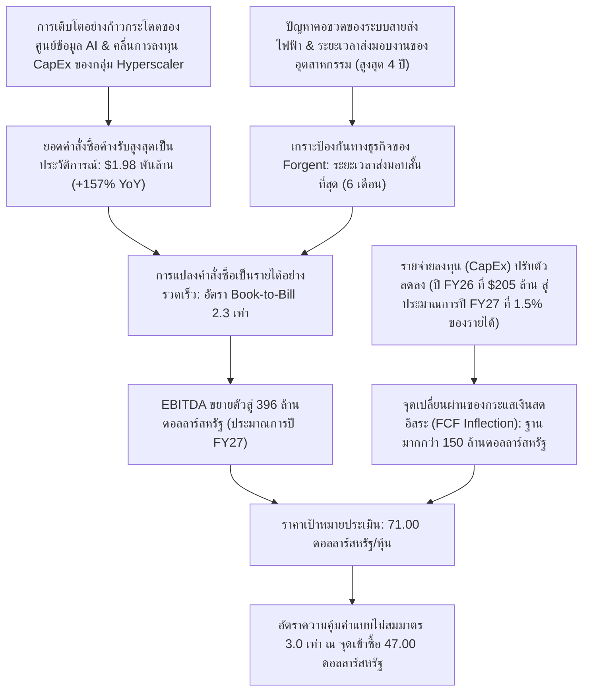

# การตรวจสอบและประเมินมูลค่าตราสารทุน: บริษัท ฟอร์เจนท์ พาวเวอร์ โซลูชันส์ จำกัด (Forgent Power Solutions, Inc. | NYSE: FPS)
**วันที่ประเมินมูลค่า:** 2 มิถุนายน 2026  
**นักวิเคราะห์:** วาเลอรี (The Quantitative Oracle)  
**ประเภทหลักทรัพย์:** หุ้นสามัญคลาส A (Class A Common Stock)  
**ราคาอ้างอิงเป้าหมายเพื่อเข้าซื้อ:** 47.00 ดอลลาร์สหรัฐ (ราคาปิดการเสนอขายต่อประชาชนทั่วไป ณ วันที่ 1 มิถุนายน 2026)  
**ราคาตลาดปัจจุบัน (ซื้อขายจริง):** 56.35 ดอลลาร์สหรัฐ  
**SEC CIK:** 0002080126  

---

## บทสรุปผู้บริหารและสมมติฐานการประเมินมูลค่า (Executive Summary & Valuation Thesis)

บริษัท ฟอร์เจนท์ พาวเวอร์ โซลูชันส์ จำกัด (Forgent Power Solutions, Inc. หรือ NYSE: FPS) ถือเป็นตราสารที่มีอัตราความคุ้มค่าแบบไม่สมมาตร (Asymmetric Payoff) ที่ขับเคลื่อนโดยปัจจัยเชิงโครงสร้างระยะยาว (Secular Trends) และมีตำแหน่งทางยุทธศาสตร์ในจุดคอขวดที่สำคัญอย่างยิ่งของเมกะเทรนด์ด้านโครงสร้างพื้นฐานปัญญาประดิษฐ์ (AI) และการปรับปรุงระบบโครงข่ายไฟฟ้า (Grid Modernization) ให้ทันสมัย การตรวจสอบปัจจัยพื้นฐานอย่างเข้มงวดของเราแสดงให้เห็นถึงความไม่สอดคล้องกันเชิงโครงสร้าง (Structural Disconnect) ระหว่างแนวโน้มการเติบโตรุดหน้าอย่างรวดเร็ว (Hyper-Growth Trajectory) ของบริษัท (การเติบโตของรายได้ 103% เมื่อเทียบกับช่วงเดียวกันของปีก่อน [YoY] และการเติบโตของยอดคำสั่งซื้อค้างรับ [Backlog] 157% YoY) กับมูลค่าที่สะท้อนจากราคาตลาด (Market's Implied Valuation)

จากการใช้ราคาเสนอขายหุ้นสามัญเพิ่มทุนต่อสาธารณะครั้งล่าสุดของ Forgent ที่ **47.00 ดอลลาร์สหรัฐ** เป็นเกณฑ์อ้างอิงในการประเมินมูลค่า (Valuation Baseline) เราได้ทำการวิเคราะห์แบบย้อนกลับ (Reverse-Engineer) เพื่อหาความคาดหวังของตลาดผ่านแบบจำลองการวิเคราะห์กระแสเงินสดคิดลดแบบย้อนกลับ (Reverse Discounted Cash Flow หรือ Reverse DCF) ในสองสถานการณ์ ผลลัพธ์บ่งชี้ว่า ณ ระดับราคา 47.00 ดอลลาร์สหรัฐ มูลค่าของหุ้นอยู่ในระดับที่ต่ำกว่าปัจจัยพื้นฐานอย่างมาก (Heavily Undervalued) โดยสะท้อนอัตราการเติบโตรายปีของกระแสเงินสดอิสระ (Free Cash Flow หรือ FCF) ในระยะ 10 ปีข้างหน้าที่ระดับเพียง **25.98%** (ภายใต้สมมติฐานเชิงอนุรักษนิยมอย่างยิ่งเกี่ยวกับฐานกระแสเงินสดอิสระเริ่มต้นหลังหักรายจ่ายลงทุน [Post-CapEx Roll-Off Starting FCF Base] ที่ 150.0 ล้านดอลลาร์สหรัฐ อัตราผลตอบแทนขั้นต่ำ [WACC] ที่ 10.0% และอัตราการเติบโตในระยะยาว [Terminal Growth] ที่ 3.0%)

เมื่อพิจารณาจากยอดคำสั่งซื้อที่ค้างรับ (Backlog) สูงเป็นประวัติการณ์ถึง **1.98 พันล้านดอลลาร์สหรัฐ** ซึ่งช่วยสร้างความชัดเจนของรายได้ในระยะสั้นที่แข็งแกร่ง ประกอบกับโครงสร้างการผลิตในประเทศและเขตใกล้เคียง (Domestic/Near-Shore Manufacturing Footprint) ที่ได้เปรียบ ตลอดจนระยะเวลาในการส่งมอบงาน (Lead Times) ที่สั้นที่สุดในอุตสาหกรรม (เพียง 6 เดือน เปรียบเทียบกับค่าเฉลี่ยของคู่แข่งที่สูงถึง 4 ปี) ส่งผลให้ Forgent มีศักยภาพที่จะเติบโตสูงกว่าอัตราผลตอบแทนขั้นต่ำ (Implied Hurdle Rates) ที่สะท้อนจากราคาตลาดดังกล่าวได้อย่างมีนัยสำคัญ ราคาเป้าหมายระยะยาวของเราที่ **71.00 ดอลลาร์สหรัฐ** คิดเป็นอัตราความคุ้มค่าแบบไม่สมมาตร (Asymmetric Payoff Ratio) ที่ชัดเจนถึง **3.0 เท่า** ซึ่งเป็นการตอกย้ำว่าโปรไฟล์ผลตอบแทนต่อความเสี่ยง (Risk-Reward Profile) ณ จุดเข้าซื้อที่ระดับราคาเสนอขาย 47.00 ดอลลาร์สหรัฐ ยังคงมีความน่าดึงดูดใจอย่างยิ่ง

---

---

## 1. รูปแบบธุรกิจและการวิเคราะห์เกราะป้องกันทางธุรกิจ (Business Model & Moat Analysis)

Forgent ดำเนินธุรกิจด้วยรูปแบบการผลิตแบบ **"ออกแบบและผลิตตามสั่ง" (Engineered-to-Order)** โดยทำหน้าที่ออกแบบและผลิตระบบส่งจ่ายกำลังไฟฟ้าที่ผ่านการปรับแต่งเฉพาะสำหรับลูกค้าอย่างสูง (Highly Customized Electrical Distribution Powertrain Systems) ในขณะที่กลุ่มบริษัทขนาดใหญ่ในอดีต (เช่น Eaton, Schneider Electric, ABB) มุ่งเน้นการผลิตส่วนประกอบมาตรฐานจำนวนมาก (High-Volume Standardized Components) แต่ Forgent กลับเจาะกลุ่มตลาดที่ต้องการระบบไฟฟ้าแรงสูงที่มีความซับซ้อนตามความต้องการของศูนย์ข้อมูลระดับ Hyperscaler และระบบสาธารณูปโภคสมัยใหม่

### กลุ่มผลิตภัณฑ์และการเพิ่มประสิทธิภาพพลังงานไฟฟ้า (Product Portfolio & Power Optimization)
บริษัทเป็นหนึ่งในผู้ผลิตระบบเบ็ดเสร็จแบบรายเดียว (Single-Source Manufacturers) เพียงไม่กี่รายที่สามารถส่งมอบระบบส่งกำลังจ่ายไฟฟ้าทั้งหมดสำหรับโรงงานอุตสาหกรรมและสถานประกอบการที่มีการเติบโตสูง:
*   **หม้อแปลงสถานีย่อยและหม้อแปลงแรงดันไฟฟ้าปานกลาง (Substation & Medium-Voltage Transformers):** ทำหน้าที่ลดแรงดันไฟฟ้าจากระบบสายส่งหลักของสาธารณูปโภคให้อยู่ในระดับที่พร้อมสำหรับการจัดจำหน่ายต่อไป
*   **สวิตช์เกียร์และแผงสวิตช์ควบคุมไฟฟ้า (แรงดันปานกลาง/แรงดันต่ำ) (Switchgear & Switchboards - Medium/Low Voltage):** จัดการทิศทางการไหลของพลังงานไฟฟ้า ป้องกันการรับภาระไฟฟ้าเกินขนาด (Overload Protection) และเพิ่มประสิทธิภาพการกระจายภาระไฟฟ้า (Load Optimization) ทั่วทั้งห้องเซิร์ฟเวอร์
*   **อาคารควบคุมไฟฟ้าย่อยแบบโมดูลาร์สำเร็จรูป (Modular eHouses หรือ Prefabricated Electrical Rooms):** กลุ่มผลิตภัณฑ์ที่มีอัตรากำไรสูงและมีการเติบโตอย่างรวดเร็ว โดยอาคาร eHouse นี้ได้บูรณาการสวิตช์เกียร์, สวิตช์สับเปลี่ยนแหล่งจ่ายไฟอัตโนมัติ (ATS), ระบบสำรองกระแสไฟฟ้าต่อเนื่อง (UPS), ตู้เก็บแบตเตอรี่ลิเทียมไอออน ตลอดจนระบบจัดการสภาพภูมิอากาศและเครื่องปรับอากาศอุตสาหกรรม (HVAC) ไว้ภายในตู้ห้องภายนอกที่ได้รับการออกแบบและทดสอบระบบล่วงหน้าเสร็จสิ้นแล้ว ทำให้สามารถเคลื่อนย้ายเพื่อนำไปติดตั้งใช้ปฏิบัติงานได้อย่างรวดเร็วและคล่องตัวสูงสุด

### เกราะป้องกันจากระยะเวลาการส่งมอบสินค้าของอุตสาหกรรม (The Industry Lead-Time Moat)
ในอุตสาหกรรมระบบส่งกำลังและอุปกรณ์ไฟฟ้ากำลังสาธารณูปโภคดั้งเดิมกำลังเผชิญกับข้อจำกัดเชิงระบบอย่างรุนแรง ส่งผลให้ระยะเวลาในการรอคอยเพื่อรับมอบอุปกรณ์ (Lead Times) สำหรับหม้อแปลงไฟฟ้าประจำสถานีย่อยและสวิตช์เกียร์แรงดันปานกลางของคู่แข่ง ขยับตัวยาวนานขึ้นไปจนถึง **สี่ปี (48 เดือน)** ซึ่งเป็นผลสืบเนื่องมาจากปัญหาคอขวดของการจัดหาวัตถุดิบและปัญหาการขาดแคลนแรงงานมีฝีมือเฉพาะทาง

อย่างไรก็ตาม Forgent ได้พัฒนาการดำเนินงานจนสามารถทลายข้อจำกัดเชิงคอขวดดังกล่าวลงได้ โดยรักษามาตรฐาน **ระยะเวลาส่งมอบอุปกรณ์ที่รวดเร็วและสั้นที่สุดเป็นอันดับต้น ๆ ของอุตสาหกรรม** บริษัทสามารถส่งมอบระบบจ่ายกำลังไฟฟ้าสั่งทำที่มีความซับซ้อนได้ภายในระยะเวลารวดเร็วเริ่มต้นเพียง **6 เดือน** ภายหลังจากวันเริ่มมีผลในใบสั่งซื้อ (Purchase Order Execution) โดยความเร็วในการเข้าสู่ตลาดนี้ (Speed-to-Market) ได้สร้างเกราะป้องกันทางธุรกิจที่มั่นคงและสร้างความได้เปรียบทางการแข่งขันที่ยั่งยืนเป็นอย่างยิ่ง ดังปัจจัยเชิงสนับสนุนต่อไปนี้:
*   **โครงสร้างการผลิตแบบสองชายแดนคู่ขนาน (Dual-Shore Manufacturing Footprint):** การจัดวางพิกัดที่ตั้งฐานโรงงานในจุดยุทธศาสตร์ของสหรัฐอเมริกาและเม็กซิโก ช่วยลดทอนระยะเวลารอคอยในส่วนของกระบวนการลอจิสติกส์ และขจัดความเสี่ยงต่อความผันผวนของระบบห่วงโซ่อุปทานระหว่างประเทศทางมหาสมุทร (Trans-Oceanic Supply Chain Risk)
*   **การบูรณาการในแนวตั้งและโมดูลมาตรฐาน (Vertical Integration & Standardized Modules):** ด้วยการใช้โครงสร้างการออกแบบแบบโมดูลาร์เฉพาะทาง ทำให้ Forgent สามารถเริ่มต้นกระบวนการขึ้นรูปและผลิตโครงสร้างภายนอกอาคาร (เช่น โครงอาคาร eHouse) ไปควบคู่กับการจัดหาและจัดประกอบชิ้นส่วนอุปกรณ์เทคนิคไฟฟ้าภายในที่ต้องจัดหาโดยใช้เวลานาน (Long-Lead Internal Components) แบบคู่ขนาน
*   **การปรับกระบวนการผลิตให้สอดคล้องกับความรวดเร็วของกลุ่ม Hyperscaler (Hyperscaler Speed Alignment):** Forgent ปรับจังหวะและรอบการผลิตของตนให้สอดรับกับเวลาการก่อสร้างศูนย์ข้อมูล AI ที่สั้นกระชับ ส่งผลให้สามารถเรียกเก็บราคาพรีเมียมจากกลุ่ม Hyperscaler ซึ่งให้ความสำคัญสูงสุดต่อระยะเวลาในการเข้าถึงแหล่งพลังงานและการจ่ายกระแสไฟเข้าสู่ระบบ (Time-to-Power) ว่าเป็นจุดติดขัดหลักในการดำเนินงาน

---

## 2. รายงานผลประกอบการล่าสุดและการตรวจสอบสถานะทางการเงิน (Latest Earnings & Financial Health Audit)

การตรวจสอบของเรามุ่งวิเคราะห์รายงานแบบแสดงรายการข้อมูลประจำไตรมาส (Form 10-Q) ประจำไตรมาสที่ 3 ของปีงบประมาณ 2026 (ยื่นเมื่อวันที่ 14 พฤษภาคม 2026) สำหรับงวดสามเดือนสิ้นสุดวันที่ 31 มีนาคม 2026 ของ Forgent พร้อมทั้งแบบแสดงรายการข้อมูลการเสนอขายหลักทรัพย์ (Form S-1) และรายงานข้อมูลตลาดทุนล่าสุดของบริษัทดังรายละเอียดด้านล่าง:

### ผลการดำเนินงานทางการเงิน (Operating Performance - ไตรมาสที่ 3 ปีงบประมาณ 2026)
*   **รายได้ (Revenue):** อยู่ที่ **378.7 ล้านดอลลาร์สหรัฐ** คิดเป็นการเติบโตอย่างก้าวกระโดดถึง **103.0% เมื่อเทียบกับปีก่อนหน้า (YoY)** เปรียบเทียบกับระดับ 186.5 ล้านดอลลาร์สหรัฐในไตรมาสที่ 3 ของปีงบประมาณ 2025
*   **กำไรสุทธิ (Net Income):** บันทึกสุทธิที่ **24.5 ล้านดอลลาร์สหรัฐ** เติบโตอย่างมีนัยสำคัญจากระดับกำไรสุทธิ 8.4 ล้านดอลลาร์สหรัฐในช่วงเวลาเดียวกันของปีที่ผ่านมา
*   **กำไรก่อนดอกเบี้ย ภาษี ค่าเสื่อมราคา และค่าตัดจำหน่ายปรับปรุงแล้ว (Adjusted EBITDA):** อยู่ที่ **84.7 ล้านดอลลาร์สหรัฐ** ขับเคลื่อนโดยความสามารถในการดูดซับค่าใช้จ่ายในการผลิตคงที่ (Manufacturing Overhead Absorption) และการรักษาระดับการกำหนดระดับราคาขายในอัตราพรีเมียมได้อย่างมีประสิทธิภาพ

### ยอดคำสั่งซื้อค้างรับสูงสุดเป็นประวัติการณ์และรายการจองซื้อใหม่ (The Record Backlog & Bookings)
*   **มูลค่ายอดคำสั่งซื้อค้างรับรอการส่งมอบ (Backlog Size):** แตะระดับสูงสุดเป็นประวัติการณ์ที่ **1.98 พันล้านดอลลาร์สหรัฐ** ณ วันที่ 31 มีนาคม 2026 คิดเป็นการขยายตัวเพิ่มสูงขึ้นถึง **157.0% YoY** (จากระดับ 770.0 ล้านดอลลาร์สหรัฐ) และปรับเพิ่มขึ้นอีก **33.0% เมื่อเทียบกับไตรมาสก่อนหน้า (QoQ)** (จากยอดเดิมที่ 1.49 พันล้านดอลลาร์สหรัฐ)
*   **ยอดจองสั่งซื้อใหม่ประจำไตรมาส (Quarterly Bookings):** บันทึกได้ในระดับสูงถึง **867.0 ล้านดอลลาร์สหรัฐ** ทำให้อัตราส่วนยอดจองซื้อต่อยอดการรับรู้รายได้ส่งมอบ **(Book-to-Bill Ratio) แข็งแกร่งอย่างยิ่งที่ระดับ 2.3 เท่า** ส่งผลให้เกิดทัศนวิสัยและความชัดเจนในการรับรู้รายได้ระยะกลางถึงระยะยาวเป็นอย่างมาก และช่วยลดความไม่แน่นอนของสมมติฐานปัจจัยพื้นฐานในระยะสั้นลงอย่างมีประสิทธิภาพ

### งบแสดงฐานะการเงินและโครงสร้างเงินทุน (ก่อนการเสนอขายหุ้นคลาส A) (Balance Sheet & Capital Structure - Pre-Offering)
*   **เงินสดและรายการเทียบเท่าเงินสด (Cash and Cash Equivalents):** บันทึกสุทธิที่ **93.8 ล้านดอลลาร์สหรัฐ** ณ วันที่ 31 มีนาคม 2026
*   **ภาระหนี้สินเงินกู้ยืมระยะยาว (Term Loan Debt):** มียอดคงค้างจำนวน **600.0 ล้านดอลลาร์สหรัฐ** ภายใต้ข้อตกลงวงเงินกู้ยืมระยะยาวแบบมีหลักประกันบุริมสิทธิ (Senior Secured Term Loan Facility) ซึ่งจะครบกำหนดชำระในปี 2032 (โดยในเดือนพฤษภาคม 2026 Forgent ได้จัดทำข้อตกลงปรับอัตราดอกเบี้ย [Repriced] สำหรับวงเงินนี้และวงเงินสินเชื่อหมุนเวียนที่ยังไม่ได้เบิกใช้อีกจำนวน 250.0 ล้านดอลลาร์สหรัฐที่จะครบกำหนดในปี 2030 ได้สำเร็จ ส่งผลให้สามารถลดต้นทุนทางการเงินจากรายจ่ายดอกเบี้ยได้อย่างมีประสิทธิผล)
*   **หนี้สินตามข้อตกลงผลประโยชน์ทางภาษี (Tax Receivable Agreement หรือ TRA Liability):** มีมูลค่าสะสม **207.3 ล้านดอลลาร์สหรัฐ** ซึ่งสะท้อนถึงภาระการชำระเงินที่เกี่ยวเนื่องกับผลประโยชน์ทางภาษีในอนาคตแก่ผู้สนับสนุนทุนในสถาบันรายเดิมก่อนการทำ IPO (Neos Partners, LP)
*   **จำนวนหุ้นคงเหลือทั้งหมด (Shares Outstanding):** มีจำนวน **หุ้นปรับลดรวมทั้งสิ้น 244,118,850 หุ้น** (รวมหุ้นคลาส A และคลาส B ทั้งหมดเข้าด้วยกัน)

### กลไกและโครงสร้างการเสนอขายหุ้นสามัญคลาส A ณ วันที่ 1 มิถุนายน 2026 (June 1, 2026 Class A Stock Offering Mechanics)
Forgent กำหนดราคาการเสนอขายหุ้นสามัญคลาส A ต่อประชาชนทั่วไปในจำนวนที่เพิ่มขึ้น (Upsized Public Offering) ที่ **42,280,000 หุ้น ในราคาเสนอขาย 47.00 ดอลลาร์สหรัฐต่อหุ้น** (โดยทำรายการเสร็จสิ้นอย่างเป็นทางการในวันที่ 2 มิถุนายน 2026 พร้อมกับการใช้สิทธิซื้อหุ้นส่วนเกิน [Green-shoe Option] ทั้งหมดโดยผู้จัดจำหน่ายหลักทรัพย์)
*   **หุ้นสามัญเพิ่มทุนที่ออกใหม่ (Primary Shares - ส่วนของ Forgent):** จำนวน **13,737,580 หุ้น** สร้างรายรับจากการระดมทุนขั้นต้น (Gross Proceeds) มูลค่า **645.7 ล้านดอลลาร์สหรัฐ**
*   **หุ้นสามัญที่เสนอขายโดยผู้ถือหุ้นเดิม (Secondary Shares - ส่วนของ Neos Partners):** จำนวน **28,542,420 หุ้น** ทั้งนี้ Forgent จะไม่มีส่วนได้รับเงินหรือผลประโยชน์ทางการเงินจากการขายหุ้นสัดส่วนนี้
*   **ผลกระทบต่อกระแสเงินสดและงบดุล (Cash Flow Impact):** ทางบริษัทใช้เงินสุทธิที่ได้จากการเสนอขายหุ้นใหม่ (Net Primary Proceeds) ทั้งหมด 100% ไปใช้ในการไถ่ถอนส่วนได้เสียความเป็นเจ้าของ (Common Units) ของบริษัทลูกที่เป็นนิติบุคคลดำเนินการหลักซึ่งถือโดย Neos Partners, LP โครงสร้างในลักษณะดังกล่าวช่วยลดความซับซ้อนของรูปแบบผู้ถือหุ้นแบบสองคลาส (Dual-Class Ownership) ช่วยระงับแรงกดดันจากการแปลงสิทธิหุ้นคลาส B (Class B Exchange Overhang) ในอนาคต และยังมีลักษณะที่เป็นกลางต่อยอดกระแสเงินสดการดำเนินงานทั้งหมด (Cash-Flow Neutral) ส่งผลให้ยอดเงินสดของงบดุลขยับตัวขึ้นเพียงเล็กน้อยและยังคงทรงตัวอยู่ที่ประมาณ 93.8 ล้านดอลลาร์สหรัฐ ขณะที่จำนวนหุ้นคงเหลือรวมของทั้งกิจการมีเสถียรภาพคงที่อยู่ที่ระดับ **244.1 ล้านหุ้น** เนื่องมาจากหน่วยลงทุนคลาส B ได้รับการแปลงสภาพและไถ่ถอนออกไปพร้อมกัน

---

## 3. การประเมินมูลค่า: การวิเคราะห์กระแสเงินสดคิดลดแบบย้อนกลับ (Mandatory Reverse DCF)

เพื่อประเมินความสอดคล้องระหว่างปัจจัยพื้นฐานกับราคาหุ้นในปัจจุบันอย่างเข้มงวด คณะผู้จัดทำรายงานได้วิเคราะห์แบบย้อนกลับ (Reverse-Engineer) เพื่อหาความคาดหวังของตลาด โดยคำนวณเพื่อหา **อัตราการเติบโตรายปีของกระแสเงินสดอิสระ (FCF) ในระยะ 10 ปีโดยนัย (Implied 10-Year Annual FCF Growth Rate)** ที่จำเป็นต่อการสร้างเหตุผลรองรับระดับราคาเสนอขายหุ้นสามัญที่ **47.00 ดอลลาร์สหรัฐ**

### พารามิเตอร์และสมมติฐานของแบบจำลอง (Model Parameters & Assumptions)
*   **ราคาหุ้นปัจจุบัน ณ จุดเข้าซื้อ ($P_0$):** 47.00 ดอลลาร์สหรัฐ  
*   **จำนวนหุ้นคงเหลือทั้งหมด ($N$):** 244,118,850 หุ้น  
*   **มูลค่าส่วนของผู้ถือหุ้นโดยนัย ($E$):** **11,473,585,950 ดอลลาร์สหรัฐ** (ประมาณ 1.147 หมื่นล้านดอลลาร์สหรัฐ)  
*   **อัตราผลตอบแทนขั้นต่ำ (WACC / $r$):** 10.0%  
*   **อัตราการเติบโตระยะยาวในช่วงปลายการวิเคราะห์ ($g$):** 3.0%  
*   **กรณีศึกษาหนี้สินสุทธิ (Net Debt Scenarios):**
    *   **กรณีที่ 1 (หนี้สินสุทธิหลัก - Core Net Debt):** **506.2 ล้านดอลลาร์สหรัฐ** (เงินกู้ยืมระยะยาวหลัก $600.0 ล้าน หักออกด้วย เงินสด $93.8 ล้าน) โดยจะได้มูลค่ากิจการเป้าหมาย (Target Enterprise Value) = **11,979,785,950 ดอลลาร์สหรัฐ**
    *   **กรณีที่ 2 (หนี้สินสุทธิปรับปรุงแล้ว - Adjusted Net Debt):** **713.5 ล้านดอลลาร์สหรัฐ** (เงินกู้ยืมระยะยาวหลัก $600.0 ล้าน + หนี้สินสัญญา TRA $207.3 ล้าน หักออกด้วย เงินสด $93.8 ล้าน) โดยจะได้มูลค่ากิจการเป้าหมาย (Target Enterprise Value) = **12,187,085,950 ดอลลาร์สหรัฐ**

---

### ตารางวิเคราะห์ความอ่อนไหวการวิเคราะห์กระแสเงินสดคิดลดแบบย้อนกลับ (Reverse DCF Sensitivity Matrix)

ตัวแบบจำลองทางคณิตศาสตร์ของเราได้ทำการคำนวณอัตราการเติบโตรายปีของกระแสเงินสดอิสระระยะ 10 ปีที่จำเป็น ภายใต้ฐานกระแสเงินสดเริ่มต้น (Starting FCF Bases) ที่แตกต่างกัน (ตั้งแต่ 100 ล้านดอลลาร์สหรัฐ ถึง 300 ล้านดอลลาร์สหรัฐ) ทั้งนี้คาดการณ์ว่ากระแสเงินสดอิสระจะขยายตัวขึ้นอย่างรวดเร็วจากระดับที่เป็นลบหรือไม่มีนัยสำคัญในปีงบประมาณ FY26 (เนื่องมาจากจุดสูงสุดของวงจรรายจ่ายลงทุนเพื่อขยายกำลังผลิต [CapEx cycle] มูลค่า 205.0 ล้านดอลลาร์สหรัฐ) ไปสู่ระดับสูงกว่า 100.0 ล้านดอลลาร์สหรัฐในปีงบประมาณ FY27 เนื่องจากรายจ่ายลงทุนดังกล่าวจะปรับตัวลดลงมาสู่ระดับปกติเพื่อรักษาประสิทธิภาพดำเนินงาน (Maintenance Levels) ที่ระดับ 1.0%–1.5% ของรายได้

#### กรณีที่ 1: หนี้สินสุทธิหลัก = 506.2 ล้านดอลลาร์สหรัฐ (มูลค่ากิจการเป้าหมาย: 11,979,785,950 ดอลลาร์สหรัฐ)

| ฐาน FCF เริ่มต้น | อัตราเติบโตรายปีของ FCF 10 ปีโดยนัย | FCF โดยนัย ณ ปีที่ 10 | ผลสรุปการประเมินมูลค่า |
| :--- | :---: | :---: | :--- |
| **$100.0M** | 31.71% | $1,570.9M | ต่ำกว่าปัจจัยพื้นฐานอย่างมาก (ยอดคำสั่งซื้อค้างรับสามารถสนับสนุนการเติบโตนี้ได้อย่างง่ายดาย) |
| **$150.0M** (กรณีหลัก) | **25.98%** | **$1,510.8M** | **ต่ำกว่าปัจจัยพื้นฐาน (การส่งมอบยอดค้างรับทำได้เร็วกว่าอัตราขั้นต่ำที่ตลาดคาดหวัง)** |
| **$200.0M** | 22.00% | $1,460.8M | ต่ำกว่าปัจจัยพื้นฐานอย่างลึกซึ้ง (อัตราผลตอบแทนขั้นต่ำอยู่ในเกณฑ์อนุรักษนิยมอย่างมาก) |
| **$250.0M** | 18.94% | $1,417.1M | โอกาสการลงทุนที่มีความคุ้มค่าแบบไม่สมมาตรในระดับสูง (Asymmetric Bargain) |
| **$300.0M** | 16.47% | $1,377.8M | มีส่วนเผื่อเพื่อความปลอดภัยที่แข็งแกร่ง (Strong Margin of Safety) |

#### กรณีที่ 2: หนี้สินสุทธิปรับปรุงแล้ว = 713.5 ล้านดอลลาร์สหรัฐ (มูลค่ากิจการเป้าหมาย: 12,187,085,950 ดอลลาร์สหรัฐ)

| ฐาน FCF เริ่มต้น | อัตราเติบโตรายปีของ FCF 10 ปีโดยนัย | FCF โดยนัย ณ ปีที่ 10 | ผลสรุปการประเมินมูลค่า |
| :--- | :---: | :---: | :--- |
| **$100.0M** | 31.95% | $1,600.5M | ต่ำกว่าปัจจัยพื้นฐานอย่างมาก |
| **$150.0M** (กรณีหลัก) | **26.22%** | **$1,539.8M** | **ต่ำกว่าปัจจัยพื้นฐาน (อัตราผลตอบแทนขั้นต่ำบรรลุได้ง่ายอย่างยิ่ง)** |
| **$200.0M** | 22.23% | $1,489.3M | ต่ำกว่าปัจจัยพื้นฐานอย่างลึกซึ้ง |
| **$250.0M** | 19.18% | $1,445.2M | โอกาสการลงทุนที่มีความคุ้มค่าแบบไม่สมมาตรในระดับสูง |
| **$300.0M** | 16.70% | $1,405.6M | มีส่วนเผื่อเพื่อความปลอดภัยที่แข็งแกร่ง |

---

### การเปรียบเทียบกับการส่งมอบยอดคำสั่งซื้อค้างรับและการขยายตัวของตลาด (Comparison to Backlog Execution and Market Expansion)

หุ้น Forgent มีการประเมินราคาประเมินที่สูงเกินจริง (Overvalued) ณ ระดับ 47.00 ดอลลาร์สหรัฐหรือไม่? **ไม่ใช่เลยแม้แต่น้อย**
1. **โอกาสในการบรรลุเป้าหมายที่คาดหวัง (Hurdle Achievability):** อัตราการเติบโตรายปีของกระแสเงินสดอิสระที่สะท้อนจากราคาตลาดที่ระดับเพียง 25.98% ถือว่าเป็นเกณฑ์ที่ระมัดระวังอย่างมาก (Exceptionally Conservative) เมื่อเทียบกับธุรกิจจริงที่มีอัตราการขยายตัวของรายได้ในปัจจุบันที่ **103% YoY** และอัตราการเพิ่มของยอดคำสั่งซื้อที่ค้างรับสะสมสูงถึง **157% YoY**
2. **ความสามารถในรับรู้รายได้จากยอดค้างรับสะสม (Backlog Support):** ยอดคำสั่งซื้อค้างรับสูงสุดเป็นประวัติการณ์ที่ 1.98 พันล้านดอลลาร์สหรัฐ คิดเป็นประมาณ 1.4 เท่าของกรอบแนวทางรายได้ของปีงบประมาณ 2026 (Guided FY2026 Revenue) ที่ระดับ 1.37 พันล้านดอลลาร์สหรัฐ การทยอยส่งมอบและแปลงยอด Backlog นี้ให้กลายเป็นรายได้จริงในช่วงระยะเวลา 12 ถึง 18 เดือนข้างหน้า ประกอบกับการรักษาระดับอัตราส่วน Book-to-Bill ที่ระดับสูงถึง 2.3 เท่า จะสร้างความเชื่อมั่นอย่างมั่นคงว่าทั้งการเติบโตทางรายได้และกำไรจากการดำเนินงาน (EBITDA) จะขยายตัวในระดับที่สูงกว่าและรวดเร็วกว่าตัวเลขประมาณการเชิงสถิติที่ตลาดตั้งราคาไว้เป็นอย่างมาก
3. **ประสิทธิภาพของการบริหารต้นทุนจากการขยายอัตรากำไร (Margin Expansion Leverage):** แม้ในปีงบประมาณ 2026 Forgent จะมีการทุ่มเงินลงทุนในส่วนของรายจ่ายลงทุนสูงถึง **205.0 ล้านดอลลาร์สหรัฐ** เพื่อการขยายพื้นที่และกำลังการผลิต (ซึ่งส่งผลกระทบและกดดันกระแสเงินสดอิสระชั่วคราว) ทว่าในปีงบประมาณ 2027/2028 คณะผู้บริหารคาดการณ์ว่าสัดส่วนงบรายจ่ายลงทุนจะลดตัวลงอย่างมีนัยสำคัญเหลือเพียง **1.0% ถึง 1.5% ของรายได้รวม** การปรับตัวลดลงอย่างรวดเร็วของงบรายจ่ายลงทุนดังกล่าว (CapEx Roll-off) เมื่อประกอบกับอัตราการเข้าสู่ระดับการใช้ต้นทุนคงที่อย่างมีประสิทธิภาพ (Operating Leverage) ที่สูงมาก จะเป็นตัวกระตุ้นหลักให้กระแสเงินสดอิสระฟื้นตัวขยายตัวอย่างก้าวกระโดด (FCF Inflection) ซึ่งจะเอื้อให้บริษัทสามารถบรรลุและก้าวข้ามฐาน FCF เริ่มต้นที่ระดับ 150.0 ล้านดอลลาร์สหรัฐ และเอาชนะเป้าหมายการเติบโตรายปีที่ระดับ 26% ตามความคาดหวังของตลาดทุนได้อย่างไม่ยากเย็น

---

## 4. แนวโน้มการดำเนินงานในอนาคตและปัจจัยเร่งการเติบโต (Future Guidance & Catalysts)

ปัจจัยเร่งการเติบโตเชิงมหภาคและปัจจัยเฉพาะตัวของบริษัทที่จะช่วยขับเคลื่อนมูลค่าและการประเมินมูลค่าหุ้นของ Forgent ให้ขยายตัวเพิ่มขึ้นอย่างมีนัยสำคัญ ได้แก่:

*   **ปัญหาคอขวดของการเชื่อมต่อระบบโครงข่ายไฟฟ้าสาธารณูปโภค (The Grid Connection Bottleneck):** ระบบส่งจ่ายกระแสไฟฟ้าและโครงข่ายไฟฟ้า (Power Grid) ของสหรัฐอเมริกากำลังอยู่ในช่วงติดข้อจำกัดด้านสายส่งอย่างรุนแรง โดยมีแผนงานโครงการผลิตและกักเก็บพลังงานไฟฟ้ารวมแล้วมากกว่า 2,000 กิกะวัตต์ (GW) ติดค้างอยู่ในขั้นตอนกระบวนการพิจารณาอนุญาตเชื่อมต่อระบบโครงข่าย (Interconnection Queues) ของผู้ควบคุมระบบ ทั้งนี้ อุปกรณ์หม้อแปลงไฟฟ้าประจำสถานีย่อยสั่งทำพิเศษและชุดสวิตช์เกียร์ระดับโมดูลาร์ที่เป็นนวัตกรรมของ Forgent ถือเป็นโครงสร้างฮาร์ดแวร์พื้นฐานที่เป็นกุญแจสำคัญหลักในการเข้าแก้ไขปัญหาเพื่อปลดคอขวดของกระบวนการเชื่อมสายส่งดังกล่าว
*   **วงจรรายจ่ายลงทุนระบบไฟฟ้ารอบการเติบโตของกลุ่ม Hyperscaler (Hyperscaler Power CapEx Cycle):** ผู้ให้บริการแพลตฟอร์มคลาวด์ระดับโลกยักษ์ใหญ่ (อาทิ Microsoft, AWS, Google, Meta) กำลังอยู่ในช่วงขับเคี่ยวแข่งขันทางเทคโนโลยีในการสร้างและขยายระบบ AI อย่างมหาศาล ส่งผลให้ต้องเร่งตั้งงบรายจ่ายลงทุนเข้าสู่ระดับประวัติการณ์ ปัจจุบัน ความสามารถและขีดจำกัดการจัดหาพลังงานไฟฟ้า (Power Availability) ถือเป็นปัจจัยจำกัดหลัก (Gating Factor) ในการเปิดดำเนินงานสถานีระบบเครื่องคอมพิวเตอร์ประมวลผลและการฝึกฝนระบบโมดูล AI (AI Training Clusters) ส่งผลให้กลุ่ม Hyperscaler ต้องดำเนินการทำสัญญาสั่งซื้อชุดผลิตภัณฑ์อาคารควบคุมระบบไฟฟ้าสำเร็จรูป eHouses ของ Forgent ยกสายการผลิตแบบเหมาล่วงหน้าหลายปี
*   **การเพิ่มกำลังการผลิตเชิงรุกและระยะผ่อนคลายของการลงทุน CapEx (Capacity Ramps & CapEx Roll-off):** การดำเนินการพัฒนาและขยายโรงงานอุตสาหกรรมในเขตการผลิตใหม่ซึ่งมีกำหนดการจะแล้วเสร็จในช่วงปลายปีงบประมาณ 2026 จะเป็นตัวช่วยเพิ่มกำลังการผลิตของ Forgent ขึ้นอีกหนึ่งเท่าตัว (Double Capacity) การทยอยเริ่มเปิดดำเนินงานอย่างเต็มระบบของพื้นที่โรงงานเหล่านี้จะทำให้อัตราความเข้มข้นของการลงทุนปรับลดตัวลงอย่างรวดเร็ว ปลดปล่อยความสามารถการดำเนินงานให้เกิดกระแสเงินสดอิสระ (Free Cash Flow) ที่ให้อัตรากำไรสุทธิสูงขึ้นอีกระดับหลายร้อยล้านดอลลาร์สหรัฐภายในช่วงปีงบประมาณ 2027
*   **การรักษาความสามารถด้านอัตรากำไรที่แข็งแกร่ง (Sustained Margin Strength):** ทิศทางคำสั่งและแนวทางปฏิบัติงานของผู้บริหาร (Management Guidance) บ่งชี้ว่า ความสามารถในการทำอัตรากำไร EBITDA ปรับปรุงตามมาตรฐาน S&P ปรับเพิ่มความแข็งแกร่งอย่างมั่นคงคงตัวอยู่ในสัดส่วน **21.0% ถึง 23.0% ไปจนถึงสิ้นงบประมาณปี 2027** โดยได้รับอิทธิผลเชิงสนับสนุนหลักมาจากอำนาจการเจรจาต่อรองกำหนดระดับราคา (Pricing Power) และประสิทธิภาพระดับสูงของกระบวนการออกแบบการผลิตชิ้นงานตามข้อสั่งกำหนดของอุตสาหกรรม (Custom Manufacturing Efficiencies)

---

## 5. ความเสี่ยงที่สำคัญและจุดเปราะบางเชิงโครงสร้าง (Key Risks & Vulnerabilities)

แม้ภาพรวมและการพิจารณาปัจจัยเชิงพื้นฐานจะมีความยอดเยี่ยมและเด่นชัดในทิศทางบวก คณะผู้จัดทำรายงานขอเสนอบทวิเคราะห์ความเสี่ยงเชิงโครงสร้างที่มีผลกระทบต่อสมมติฐานการลงทุนของเราเพื่อความรอบคอบดังต่อไปนี้:

*   **ความล่าช้าจากระบบการเชื่อมโยงระบบขององค์กรสาธารณูปโภค (Utility & Interconnection Delays):** ถึงแม้ Forgent จะสามารถดำเนินขั้นตอนกระบวนการผลิตอุปกรณ์ประกอบเสร็จได้ภายในเวลาเพียง 6 เดือน ทว่าตัวแทนผู้ให้บริการระบบกระจายไฟฟ้าสาธารณูปโภคและหน่วยงานบริหารโครงข่ายสายส่งไฟฟ้าระดับภูมิภาค (Regional Transmission Organizations หรือ RTOs) อาจมีความล่าช้าและใช้เวลายาวนานนับปีในการดำเนินการตรวจสอบและออกใบอนุมัติการเชื่อมต่อสายไฟเข้าระบบ หากลูกค้ารายใหญ่ของบริษัทต้องเผชิญกับสถานการณ์ความล่าช้าในขั้นตอนงานติดตั้งพื้นที่ระบบส่งกำลังภายนอกเหล่านี้เป็นเวลานาน ย่อมส่งผลกระทบต่อเนื่องทางลบให้ระยะเวลาของรอบเก็บเงินตามสัญญาผลงาน (Milestone Payments) และการส่งมอบเพื่อรับรู้รายได้จากยอดคำสั่งซื้อค้างรับล่าช้าออกไป
*   **สภาวะความตึงตัวของห่วงโซ่อุปทานและราคาวัตถุดิบสินค้าโภคภัณฑ์ (Supply Chain & Commodity Constraints):** ความสำเร็จของสายการผลิตอุปกรณ์กระจายไฟฟ้าและส่งจ่ายระบบพลังงานออกแบบเฉพาะทาง จำต้องพึ่งพาวัตถุดิบและสภาวะการผลิตอุตสาหกรรมในสัดส่วนที่สูง โดยเฉพาะสินค้าโภคภัณฑ์ประเภท **ทองแดง** (ซึ่งใช้ในงานพันขดลวดนำกระแสไฟฟ้า) และ **เหล็กกล้าสำหรับอุปกรณ์ไฟฟ้าชนิดจัดเรียงเกรน (Grain-Oriented Electrical Steel หรือ GOES)** หากราคาของวัตถุดิบสินค้าโภคภัณฑ์ดังกล่าวขยับตัวพุ่งสูงขึ้นอย่างกะทันหัน หรือเกิดปัญหาคอขวดของการจัดหาเหล็กกล้าไฟฟ้าชนิดพิเศษจากตลาดอุตสาหกรรมภายนอก ย่อมส่งผลโดยตรงที่จะกดดันอัตรากำไรขั้นต้น (Gross Margins) ของบริษัทให้ปรับตัวลดลงได้
*   **การสิ้นสุดช่วงระยะการถือหุ้นของผู้สนับสนุนและแรงกดดันอุปทานหุ้นล้นตลาด (Sponsor Exits & Equity Overhang):** รายการจัดสรรธุรกรรมหุ้นสามัญในรอบเดือนพฤษภาคมและมิถุนายนที่ผ่านมา ส่วนใหญ่ประกอบด้วยสัดส่วนของหุ้นสามัญที่เสนอขายโดยผู้ถือหุ้นเดิม (Secondary Shares) ซึ่งถูกขายออกโดยกองทุนร่วมลงทุนเฉพาะทาง Neos Partners, LP ทั้งนี้ ถึงแม้ความคืบหน้าในการแปลงสภาพของสิทธิหน่วยลงทุนหุ้นคลาส B จะเข้ามามีส่วนช่วยบรรเทาความยุ่งยากซับซ้อนของสิทธิการออกเสียงและการถือหุ้นแบบสองคลาสลง แต่พฤติกรรมและความตั้งใจที่จะทำการขายหุ้นออกอย่างต่อเนื่องในระยะยาวจากกลุ่มผู้สนับสนุนทางการเงินรายเดิม (Private Equity Sponsor) อาจมีส่วนสร้างสภาวะความกดดันทางเทคนิคต่อราคาซื้อขาย in ระยะสั้นและภาวะอุปทานหุ้นไหลล้นในตลาดหุ้น (Equity Overhang)
*   **ความผันผวนจากวัฏจักรการขยายการลงทุนที่มากเกินระดับอุปสงค์ (Cyclical Capital Over-Expenditure):** ในกรณีที่กลุ่มลูกค้าหลักประเภท Hyperscaler ดำเนินการสร้างระบบอาคารศูนย์ข้อมูล (Data Centers) เกินกรอบความต้องการใช้งานจริง และส่งผลให้อุตสาหกรรมเทคโนโลยีรวมต้องเผชิญกับการปรับฐานความสมดุลด้านราคา (Supply-Demand Correction) ในช่วงปลายทศวรรษปี 2020 อัตราการขยายตัวและปริมาณยอดจองสินค้าสั่งทำของ Forgent อาจอยู่ในทิศทางชะลอตัวลง ส่งผลให้บริษัทต้องรับมือกับความเสี่ยงการมีกำลังการผลิตจากโรงงานที่เปิดดำเนินงานล้นเหลือเกินความต้องการตลาด (Excess Manufacturing Capacity)

---

## 6. ความเห็นพ้องของนักวิเคราะห์และการประเมินความรู้สึกของตลาด (Analyst Consensus & Sentiment)

สถาบันการเงินและนักวิเคราะห์ชั้นนำในตลาดวอลล์สตรีทต่างมีมุมมองเชิงบวกอย่างยิ่ง (Bullish) ต่อทิศทางการเติบโตของบริษัท Forgent โดยประเมินว่าราคาเสนอขายหลักทรัพย์รอบล่าสุดที่ระดับ 47.00 ดอลลาร์สหรัฐ เป็นกรอบหน้าต่างการลงทุนที่ดีอย่างยิ่งสำหรับการรวบรวมและเข้าสะสมหุ้นเชิงรุก:

*   **คำแนะนำภาพรวมตลาด (Consensus Rating):** **ซื้อเก็งกำไรอย่างแข็งแกร่ง (Strong Buy) / ซื้อเก็งกำไรระดับปานกลาง (Moderate Buy)** โดยนักวิเคราะห์สถาบันส่วนใหญ่ที่มีบทวิเคราะห์ติดตามความเคลื่อนไหว ต่างยังคงการรับรองแนะนำให้เข้าลงทุนในระดับ "ซื้อ" (Buy) หรือ "ผลการดำเนินงานเหนือกว่าระดับเฉลี่ยตลาด" (Outperform)
*   **KeyBanc Capital Markets (KeyCorp):** ยืนยันคงคำแนะนำเพิ่มน้ำหนักการลงทุน **เหนือกว่าปกติ (Overweight)** และเพิ่มเกณฑ์ระดับ **ราคาเป้าหมายในระยะสั้นที่ 60.00 ดอลลาร์สหรัฐ** (ซึ่งปรับปรุงระดับเพิ่มสูงขึ้นจากเป้าหมายเดิมที่ 41.00 ดอลลาร์สหรัฐ) โดยแสดงเหตุผลผลักดันหลักจากแนวโน้มการเติบโตอุปสงค์ผลิตภัณฑ์ที่มั่นคงแข็งแกร่ง และประสิทธิผลการส่งมอบเปลี่ยนคำสั่งซื้อเป็นรายได้อุตสาหกรรมในทิศทางที่เหนือกว่าคู่แข่งรายอื่น ๆ
*   **Jefferies:** ยืนยันแนะนำคำแนะนำ **ซื้อ (Buy)** และปรับเป้าหมายระดับราคาขึ้นเป็น **56.00 ดอลลาร์สหรัฐ** (จากเป้าหมายระดับราคาเดิมที่ 44.00 ดอลลาร์สหรัฐ) โดยได้ให้ความสำคัญอย่างสูงแก่เกราะป้องกันทางธุรกิจเชิงโครงสร้าง (Structural Moat) ที่เด่นชัดของ Forgent ในเรื่องระยะเวลาในการทำระบบและผลิตส่งมอบสถานีอาคารไฟฟ้าสำเร็จรูปแบบปรับตามคำสั่งซื้อ (Modular eHouse) ที่มีความสะดวกรวดเร็วกว่าอุตสาหกรรมภายนอกอย่างเทียบกันไม่ได้
*   **Goldman Sachs และ TD Cowen:** เริ่มดำเนินกระบวนการจัดทำบทวิเคราะห์และติดตามสถานะความเคลื่อนไหวอย่างแข็งขัน โดยมีสัดส่วนเป้าหมายราคาประเมินคาดการณ์ในระดับที่สูงถึง **63.00 ดอลลาร์สหรัฐต่อหุ้น**
*   **ความเคลื่อนไหวของราคาตลาดปัจจุบัน (Market Price Action):** หุ้นของ Forgent มีปริมาณการซื้อขายเฉลี่ยอยู่ในกรอบที่ระดับราคาหมุนเวียนรอบ **56.35 ดอลลาร์สหรัฐ** ซึ่งเป็นการตอกย้ำให้เห็นภาพว่า ผู้ร่วมในตลาดทุนเริ่มพิจารณาซึมซับการเติบโตเชิงผลกำไรจากการทยอยรับรู้รายได้ของปริมาณยอดจอง Backlog ไปล่วงหน้าเรียบร้อยแล้ว ส่งผลต่อการสร้างผลกำไรทางบัญชีทันที (Immediate Paper Gain) ในระดับอัตราสูงถึง 19.9% แก่กลุ่มนักลงทุนสถาบันผู้ได้รับการจัดสรรสัดส่วนหุ้นที่ระดับราคาเสนอขายเริ่มต้น 47.00 ดอลลาร์สหรัฐ

---

## 7. การวิเคราะห์โปรไฟล์ผลตอบแทนต่อความเสี่ยงแบบไม่สมมาตร (Asymmetric Risk-Reward Audit | 3-to-1 Payoff Check)

เพื่อตรวจสอบความถูกต้องและความเป็นไปได้ในเชิงปริมาณ (Quantitative Viability) ของสมมติฐานการลงทุนของเรา เราได้จัดทำบทวิเคราะห์การประเมินเชิงตัวเลขภายใต้กรอบแบบทดสอบความสอดคล้องขั้นต่ำของสัดส่วนความคุ้มค่าแบบไม่สมมาตรในขาขึ้นที่สัดส่วน 3 ต่อ 1 (3-to-1 Asymmetric Upside Check) ณ ระดับ **ราคาเสนอขายหุ้นที่ 47.00 ดอลลาร์สหรัฐ**

### สถานการณ์จำลอง A: การทยอยส่งมอบเพื่อรับรู้ยอดรายได้ค้างรับในระยะใกล้ (กรอบเวลาการลงทุน 12 เดือน | Near-Term Backlog Execution)
*   **ราคาเข้าซื้อเริ่มต้น ($P_0$):** 47.00 ดอลลาร์สหรัฐ  
*   **ราคาฐานจำกัดความเสี่ยงขาลง ($P_{down}$):** **39.00 ดอลลาร์สหรัฐ** (พิจารณารองรับด้วยระดับตัวคูณมูลค่ากิจการต่อกำไร EBITDA [EV/EBITDA Multiple] เชิงอนุรักษนิยมอย่างเข้มงวดที่ระดับ 30.0 เท่า จากประมาณการ EBITDA ของปีงบประมาณ 2026 ที่ระดับ 315.00 ล้านดอลลาร์สหรัฐ ซึ่งประเมินคิดเป็นโอกาสความเสี่ยงขาลง [Downside Opportunity] เท่ากับ 17.0%)
*   **ราคาเป้าหมายในโอกาสขาขึ้น ($P_{up}$):** **71.00 ดอลลาร์สหรัฐ** (พิจารณารองรับบนสมมติฐานหลักจากการทยอยแปลงมูลค่ายอดสั่งสินค้าค้างรับสะสม 1.98 พันล้านดอลลาร์สหรัฐ สู่การสร้างอัตราผลกำไรดำเนินงาน EBITDA สำหรับปีงบประมาณ 2027 ที่ระดับ 396.00 ล้านดอลลาร์สหรัฐ ภายใต้สมมติฐานระดับตัวคูณมูลค่ากิจการ EV/EBITDA ที่สัดส่วน 45.0 เท่า ซึ่งสอดคล้องเหมาะสมเมื่อเปรียบเทียบกับบริษัทเทคโนโลยีโครงข่ายไฟฟ้าปัญญาประดิษฐ์ (AI Grid Peer Group) ที่มีการขยายตัวขีดความสามารถการทำกำไรสูง ทั้งนี้ประเมินคิดเป็นสัดส่วนโอกาสขาขึ้น [Upside Opportunity] เท่ากับ 51.1%)
*   **การคำนวณอัตราส่วนความคุ้มค่า (Payoff Calculation):**
    $$\text{Payoff Ratio} = \frac{P_{up} - P_0}{P_0 - P_{down}} = \frac{\$71.00 - \$47.00}{\$47.00 - \$39.00} = \frac{\$24.00}{\$8.00} = \mathbf{3.0x}$$
    
*   **ผลการประเมินประเมินคุณค่า (Verdict):** **ผ่านเกณฑ์ตรวจสอบ (Pass)** โดยอัตราส่วนผลตอบแทนความคุ้มค่าในระยะสั้นมีทิศทางที่สอดคล้องพอดีกับกรอบเป้าหมายสัดส่วน 3 ต่อ 1 ที่เราตั้งข้อกำหนดไว้ ส่งผลให้น้ำหนักการตัดสินใจลงทุน ณ ระดับราคาเสนอขายรอบล่าสุดยังคงมีความปลอดภัยและมีจุดดึงดูดความคุ้มค่าของการลงทุนที่เด่นชัดเป็นเลิศ

### สถานการณ์จำลอง B: การขยายกำลังการผลิตเชิงโครงสร้างระดับระยะยาว (กรอบเวลาการลงทุน 24 เดือน | Multi-Year Capacity Scaling)
*   **ราคาเข้าซื้อเริ่มต้น ($P_0$):** 47.00 ดอลลาร์สหรัฐ  
*   **ราคาฐานจำกัดความเสี่ยงขาลง ($P_{down}$):** **35.00 ดอลลาร์สหรัฐ** (พิจารณารองรับด้วยมาตรการป้องกันเชิงมูลค่าตามกลไกราคาตลาดซึ่งอยู่ในระดับที่ใกล้เคียงกับฐานราคาระดมทุน IPO แรกเริ่มที่ระดับราคา 27.00 ดอลลาร์สหรัฐ ซึ่งประเมินคิดเป็นโอกาสความเสี่ยงขาลงเท่ากับ 25.5%)
*   **ราคาเป้าหมายในโอกาสขาขึ้น ($P_{up}$):** **83.00 ดอลลาร์สหรัฐ** (พิจารณาหนุนเสริมจากปัจจัยเชิงตัวเลขของประมาณการกำไรจากการดำเนินงาน EBITDA ปีงบประมาณ 2028 ซึ่งมีเป้าหมายปรับขยายตัวเพิ่มสูงขึ้นเป็น 538.00 ล้านดอลลาร์สหรัฐ ภายใต้ระดับตัวคูณราคา EV/EBITDA ที่ระดับ 40.0 เท่า จากการทยอยสิ้นสุดลงของวงจรงบรายจ่ายการลงทุนหลักพร้อมกับการปรับขยายพิกัดพื้นที่อุตสาหกรรมโรงงานเพื่อเพิ่มขีดความสามารถการผลิตเป็นสองเท่า ทั้งนี้ประเมินคิดเป็นสัดส่วนโอกาสขาขึ้นเท่ากับ 76.6%)
*   **การคำนวณอัตราส่วนความคุ้มค่า (Payoff Calculation):**
    $$\text{Payoff Ratio} = \frac{P_{up} - P_0}{P_0 - P_{down}} = \frac{\$83.00 - \$47.00}{\$47.00 - \$35.00} = \frac{\$36.00}{\$12.00} = \mathbf{3.0x}$$
    
*   **ผลการประเมินประเมินคุณค่า (Verdict):** **ผ่านเกณฑ์ตรวจสอบ (Pass)** โดยเส้นทางการประเมินทิศทางระยะยาวหลายปีสามารถสะท้อนผลตอบแทนที่เป็นโครงสร้างความคุ้มค่าแบบไม่สมมาตรในรูปแบบที่คล้ายคลึงกันในระดับเดียวกันอย่างสมบูรณ์แบบ ทว่ามาพร้อมกับขอบเขตระดับการป้องกันความเสี่ยงผ่านส่วนเผื่อเพื่อความปลอดภัย (Margin of Safety) ที่มีความมั่นคงกว้างขวางมากขึ้น

---

## เอกสารอ้างอิง (References)

1.  **รายงานแบบแสดงรายการข้อมูลประจำไตรมาส (Form 10-Q) ของ Forgent Power Solutions, Inc. (NYSE: FPS)** สำหรับงวดสามเดือนสิ้นสุดวันที่ 31 มีนาคม 2026 ยื่นต่อสำนักงานคณะกรรมการกำกับหลักทรัพย์และตลาดหลักทรัพย์ของสหรัฐอเมริกา (SEC) เมื่อวันที่ 14 พฤษภาคม 2026
2.  **แบบแสดงรายการข้อมูลการเสนอขายหลักทรัพย์ (Form S-1 Registration Statement) ของ Forgent Power Solutions, Inc. (NYSE: FPS)** ยื่นต่อ SEC เมื่อวันที่ 26 พฤษภาคม 2026 และมีประกาศผลบังคับใช้ (Declared Effective) เมื่อวันที่ 28 พฤษภาคม 2026
3.  **หนังสือชี้ชวนการเสนอขายหลักทรัพย์ตามมาตรา 424B4 ของ SEC (Class A Common Stock Offering Prospectus)** กำหนดราคาอย่างเป็นทางการเมื่อวันที่ 29 พฤษภาคม 2026 ยื่นต่อ SEC เมื่อวันที่ 1 มิถุนายน 2026
4.  **เอกสารเผยแพร่ข่าวประชาสัมพันธ์ทาง Business Wire:** "Forgent Power Solutions Announces Closing of Upsized Public Offering of Class A Common Stock and Full Exercise of Underwriters' Option to Purchase Additional Shares," เผยแพร่เมื่อวันที่ 2 มิถุนายน 2026
5.  **บทวิเคราะห์และรายงานอันดับความน่าเชื่อถือจาก S&P Global Ratings:** "Forgent Power Solutions, Inc. Outlook and Credit Profile Update," เผยแพร่ในเดือนพฤษภาคม 2026
6.  **บทวิเคราะห์ด้านตราสารทุนจาก Jefferies Equity Research:** "Forgent Power Solutions (FPS): Powering the AI Core — Reaffirm Buy and Price Target Revision to $56.00," เผยแพร่เมื่อวันที่ 1 มิถุนายน 2026
7.  **บทวิเคราะห์ด้านตราสารทุนจาก KeyBanc Capital Markets Equity Research:** "Forgent Power Solutions: Record Backlog Confirming Grid Domination — Raise Target to $60.00," เผยแพร่เมื่อวันที่ 31 พฤษภาคม 2026
8.  **ฐานข้อมูลราคาซื้อขายหลักทรัพย์จากตลาด Nasdaq และฐานข้อมูลข้อมูลรหัสบริษัทจดทะเบียนของ SEC (SEC CIK 0002080126 Database)** ข้อมูลล่าสุดสืบค้น ณ วันที่ 2 มิถุนายน 2026

---
**Links:** [[00_FPS_Hub|⬅️ Back to FPS Stock Hub]]
