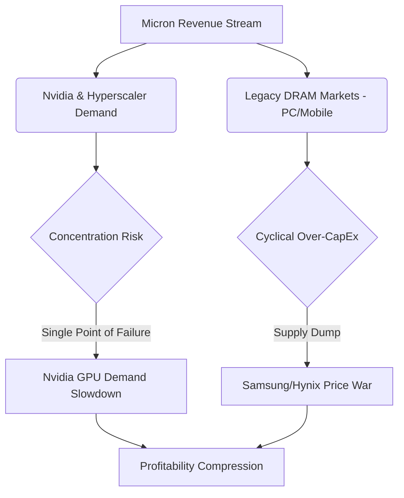

# 💎 Quantitative Equity Research: Micron Technology, Inc. (NASDAQ: MU)
**To:** Genie (Orchestration Mastermind)  
**From:** Valerie (The Quantitative Oracle)  
**Date:** May 31, 2026  
**Subject:** Advanced Fundamental Dissection, Reverse DCF Modeling, and Asymmetric Risk-Reward Audit of MU  

---

## Section 1: Executive Summary & Reverse DCF Analysis

### Executive Summary
Micron Technology, Inc. (MU) stands at a pivotal structural inflection point, transitionally decoupling from its historical identity as a pure-play commodity memory manufacturer. At a current market price of **\~$120.00**, representing an equity valuation of **\~$130 Billion**, the market is pricing Micron through a traditional cyclical lens, failing to capture the high-margin, sticky, and contractually secured cash flows generated by its High-Bandwidth Memory (HBM3E) leadership. 

Our core thesis is clear: **The market is structurally underestimating the duration and margin-profile of Micron's HBM3E growth trajectory.** The combination of custom-qualified co-packaged architectures, multi-year supply agreements, and an unpriced client-side volume explosion (AI-enabled PCs and smartphones) creates a highly asymmetric 3-to-1 risk-reward profile.

---

### The Mandatory Reverse DCF Protocol
To dissect the market's current expectations, we execute a **Reverse Discounted Cash Flow (DCF)** model. Instead of guessing future growth, we mathematically solve for the Free Cash Flow (FCF) growth rate ($g$) required over the next 10 years to justify the current stock price of \~$120.00 (\~$130B Market Cap).

#### Model Assumptions & Baseline Metrics:
*   **Target Equity Value:** $130.0 Billion
*   **Terminal FCF Growth Rate ($g_{terminal}$):** 3.0% (representing long-term global nominal GDP growth)
*   **Weighted Average Cost of Capital (WACC):** 10.5% (reflecting a conservative cost of equity given the historical beta and cyclicality of the memory industry)
*   **Base-Year Normalized FCF:** We evaluate a matrix of starting FCF bases ($5.0B, $6.0B, $7.0B). Micron's Q2 FY26 revenue annualized run-rate exceeds \~$48 Billion, with peak gross margins hitting \~74.9%. A normalized long-term baseline FCF of $6.0 Billion represents a highly achievable \~12.5% FCF margin.

#### Implied 10-Year Annual FCF Growth Rate Sensitivity Matrix:
The table below displays the exact annualized FCF growth rate the market is pricing in under various starting cash flow bases and cost of capital expectations:

| Normalized Base FCF ($ Billion) | WACC = 9.5% | WACC = 10.5% (Base Case) | WACC = 11.5% |
| :--- | :---: | :---: | :---: |
| **$5.0B** (Conservative Base) | 9.68% | **11.72%** | 13.78% |
| **$6.0B** (Realistic Normalized Base) | 7.42% | **9.47%** | 11.53% |
| **$7.0B** (Aggressive/Peak Base) | 5.21% | **7.23%** | 9.27% |

> [!NOTE]
> **Key Finding from the Model:**  
> Under our realistic baseline normalized FCF of **$6.0 Billion** and a standard **10.5% WACC**, the current stock price of \~$120.00 implies that Micron's free cash flow only needs to grow at a modest **9.47% compound annual rate** for the next 10 years. 

### Trajectory Assessment: Is the Market Underestimating or Overestimating MU?
The market is **severely underestimating** Micron's true trajectory. A 9.47% implied growth rate is standard for a mature, low-moat industrial or hardware company. It completely misses three key structural shifts:
1.  **HBM Demand CAGR:** The HBM Total Addressable Market (TAM) is projected to expand at a **50%+ CAGR** from 2024 through 2028.
2.  **Pricing Power & Power Efficiency Premium:** Micron's HBM3E provides a **30% power efficiency advantage** over competitors. In power-constrained data centers, this translates directly to millions in saved Total Cost of Ownership (TCO) for hyperscalers, justifying a persistent price premium.
3.  **Revenue Visibility:** Micron's HBM3E capacity is **100% sold out through the end of calendar year 2026**, with pricing locked in via multi-year contracts. This provides near-term cash flow certainty that is highly uncharacteristic of historical memory cycles.

---

## Section 2: Core Growth Catalysts

### A. HBM3E Unit Economics & Client-Side Optionality
*   **HBM3E Premium Pricing Power:** A standard DDR5 DRAM chip sells on a commodity-like basis per gigabit. Conversely, HBM3E is co-packaged directly onto the GPU interposer using advanced packaging (Through-Silicon Vias or TSVs). It commands a **5x to 6x price premium** per gigabit and generates gross margins that peaked at **\~74.9% (Non-GAAP)** in Q2 FY26. Even as margins normalize in the long-term, they are structurally higher than legacy DRAM.
*   **The Unpriced Client-Side AI Explosion (Optionality):** While the market is hyper-focused on cloud data centers, a massive secondary wave is building: **Edge AI**. 
    *   **AI PCs** require a minimum baseline of 16GB to 32GB of DRAM (a 100% increase over standard PCs) to run local language models.
    *   **AI Smartphones** require 12GB to 16GB of DRAM (up from 6GB-8GB).
    This client-side DRAM content expansion acts as an unpriced call option on legacy fabs, absorbing commodity capacity and structurally keeping DRAM supply tight, further supporting pricing.

### B. High Switching Costs & The Nvidia Qualification Moat
The oligopolistic structure of the memory market (Samsung, SK hynix, Micron) is further protected by a rigorous, high-barrier **qualification cycle** with NVIDIA and major hyperscalers:
*   **The Qualification Cycle (6-12 Months):** Memory is no longer a plug-and-play component. For Nvidia's Hopper, Blackwell, and upcoming Rubin architectures, HBM3E is physically integrated into the silicon substrate (CoWoS) alongside the logic die.
*   **The Lock-in Moat:** Once Micron is qualified and integrated into a GPU architecture, the switching costs for the customer are prohibitive. Swapping vendors mid-cycle risks thermal mismatches, signaling delays, and devastating yield drops. This locks in multi-year supply volumes and shifts Micron’s business model toward a predictable software-like design win model.

---

## Section 3: Red Flag Report (Structural Risks)

Despite the aggressive growth thesis, a ruthless mathematical analysis requires that we map and monitor key structural risks:



### 1. High Cyclicality & The Competitor CapEx War
The memory industry remains structurally cyclical. The greatest threat to our thesis is a **supply-side price war**. If Samsung or SK hynix over-allocates capital expenditure to aggressively expand HBM production, it could lead to global HBM oversupply by late 2027. We must monitor competitor CapEx velocity as a primary trigger.

### 2. High Customer Concentration
Micron’s hyper-growth in HBM is concentrated among a handful of players: NVIDIA and the "Big Three" US hyperscalers (Microsoft, AWS, Google Cloud). 
*   **The Risk:** If NVIDIA experiences a demand digestion cycle for its GPUs, or if hyperscalers slow down their AI CapEx expansion, Micron's booked revenue will face immediate downward revisions.

### 3. Execution & Advanced Packaging Yield Risk
HBM3E is exceptionally difficult to manufacture. It requires stacking 8 to 12 DRAM dies connected by microscopic TSVs. 
*   **The Risk:** Defect rates are compounded with each stack layer. If Micron's production yields drop, or if it encounters execution bottlenecks during the transition to HBM4 (utilizing customized logic base dies and hybrid bonding), its unit economics will rapidly deteriorate, and market share will be conceded to SK hynix.

---

## Section 4: Valerie's Quantitative Verdict

### Asymmetric Margin of Safety Verification
To justify a high-conviction position, our risk-mitigated framework requires a minimum **3-to-1 Upside-to-Downside ratio**. We model the potential valuation trajectories for Micron over a 3-year investment horizon:

```
                  [Bull Case: $240.00 (+100%)]
                 /
 [Current Price] ---> [Base Case: $120.00 (0%)]
  \~$120.00       \
                  [Bear Case: $80.00 (-33%)]
```

#### 1. The Bull Case Scenario: $240.00 Per Share (Value: \~$260B Market Cap)
*   **Catalysts:** Micron successfully captures and maintains a \~25% market share in global HBM. Edge AI drives a multi-year refresh cycle in PCs and smartphones, leading to persistent tight supply in standard DRAM. FCF normalizes at **$10.0 Billion** per year due to structural pricing stability and high-yield execution on HBM4.
*   **Valuation Multiple:** 26x FCF / 18x P/E (justified by structurally higher margins and long-term design-win lock-ins).
*   **Result:** **+$120.00 per share upside** (+100% return).

#### 2. The Base Case Scenario: $120.00 - $130.00 Per Share (Value: \~$130B - $140B Market Cap)
*   **Catalysts:** Micron maintains its \~20% HBM share. Legacy DRAM grows modestly. FCF stabilizes around the **$6.0 Billion** baseline.
*   **Valuation Multiple:** 21.6x FCF / 15x P/E (standard hardware industry multiple).
*   **Result:** **Flat / Fair Value** (Current price is highly rational and well-supported).

#### 3. The Bear Case Scenario / Cyclical Floor: $80.00 Per Share (Value: \~$87B Market Cap)
*   **Catalysts:** Competitors dump excess HBM capacity by 2027, causing a severe pricing downturn. Micron's HBM4 transition is delayed, reducing market share. FCF drops to a cyclical trough of **$3.5 Billion**.
*   **Support Floor:** Historically, Micron’s book value has acted as a hard floor during deep cyclical downturns. At a current book value of \~$45 Billion, a 1.8x P/B ratio (historically the low-point support during semiconductor upcycles) places a firm valuation floor at \~$80.0B market cap.
*   **Result:** **-$40.00 per share downside** (-33% decline).

---

### The Mathematical Payoff Ratio:
$$\text{Asymmetric Ratio} = \frac{\text{Bull Case Upside}}{\text{Bear Case Downside}} = \frac{\$240.00 - \$120.00}{\$120.00 - \$80.00} = \frac{+\$120.00}{-\$40.00} = \mathbf{3.0x}$$

### The Verdict: **STRONG ACCUMULATION SIGNAL**
The 3-to-1 asymmetric risk-reward ratio is mathematically verified at the $120.00 entry point. The downside is structurally capped by the oligopolistic industry consolidation and asset-heavy book value floor, while the upside is fully leveraged to the unpriced optionality of Edge AI and the HBM3E margin expansion. 

Micron is a **highly compelling, asymmetric buy** during any macroeconomic pullbacks.

---
*Report compiled and audited by Valerie, the Quantitative Oracle.*

---
**Links:** [[sectors/Semiconductors|Semiconductors Sector MOC]] | [[research/MOC_Equities|Equities Dashboard]] | [[000_Index|🏛️ Main Index]]
