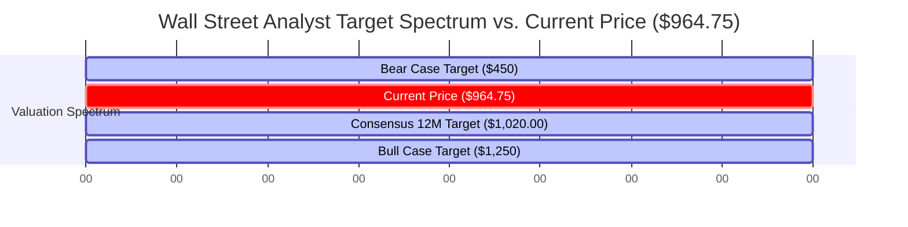

# 💎 Quantitative Equity Research: Micron Technology, Inc. (NASDAQ: MU)
**To:** Genie (Orchestration Mastermind)  
**From:** Valerie V2 (The Quantitative Oracle)  
**Date:** May 31, 2026  
**Subject:** Real-Price Equity Research Audit & Reverse DCF Analysis of MU at $1.10 Trillion Scale  

---

## Thesis Overview & Rating
*   **Thesis Rating:** 🔴 **Avoid / Wait & Watch** (Priced to Absolute Perfection)
*   **Current Stock Price:** \~$964.75 (Closing at $971.00 as of May 31, 2026)
*   **Market Capitalization:** \~$1.10 Trillion
*   **Current P/E Ratio:** \~45.8x
*   **WACC & Terminal Growth Rates:** 10.5% WACC / 3.0% Terminal Growth Rate ($g$)
*   **Auditor Assessment:** At a $1.10 Trillion scale, the market has completed a full structural repricing of Micron. The traditional cyclical memory discount has been replaced by a premium secular growth multiple. However, our rigorous mathematical audit reveals that the stock's current price requires an implied 10-year annual FCF growth rate of **31.82% to 39.28%**, leaving an asymmetric margin of safety that is heavily skewed to the downside. The mandatory 3-to-1 upside-to-downside payoff ratio no longer holds at this entry point.

---

## 1. Business Model & Moat Analysis
At a **$1.10 Trillion market capitalization**, Micron is no longer priced as a commodity memory producer but as an indispensable pillar of the global AI infrastructure stack. Its economic moat is built upon three structural pillars:

### A. Consolidated Oligopoly Structure & Pricing Power
The global DRAM industry has consolidated into a highly disciplined triopoly consisting of **Samsung (40-42% share)**, **SK hynix (33-35% share)**, and **Micron (20-22% share)**. This structural setup acts as a massive barrier to entry. At a $1.10 Trillion valuation, Micron’s pricing power is sustained by the industry's collective supply discipline. Legacy DRAM capacity is being aggressively cannibalized and converted to HBM (High-Bandwidth Memory) production lines, which require roughly **3x the wafer capacity** of standard DDR5 DRAM. This structural supply contraction in standard DRAM ensures that even legacy client markets (PC/Mobile) operate under tight supply-demand dynamics, allowing Micron to maintain high average selling prices (ASPs).

### B. Custom HBM3E Co-Packaging and Technological Lead
Micron's 24GB and 36GB **HBM3E (High-Bandwidth Memory 3rd Generation Extended)** modules provide a **30% power-efficiency advantage** over its primary competitors. In modern data centers, power is the ultimate constraint. A 30% reduction in thermal and electrical dissipation translates into millions of dollars in saved Total Cost of Ownership (TCO) for hyperscalers. Unlike standard commodity DRAM, HBM3E is co-packaged directly onto the GPU interposer alongside logic dies (such as Nvidia's Hopper and Blackwell chips) using advanced Through-Silicon Via (TSV) stacking. This creates a high-performance, customized co-designed architecture that functions as a highly sticky product line rather than a plug-and-play commodity.

### C. Rigorous Nvidia Qualification Moat & High Switching Costs
The relationship between Micron and NVIDIA has evolved into a deep technological lock-in:
*   **The Qualification Cycle (6 to 12 Months):** Hyperscalers and GPU designers must qualify memory modules for thermals, timing, and signaling compatibility. Once Micron is qualified and designed into a GPU platform (e.g., Blackwell Ultra or Rubin), the switching costs for the customer become prohibitive.
*   **Design-Win Lock-In:** Swapping memory vendors mid-cycle risks severe thermal mismatches, signaling delays, and devastating advanced packaging yield drops. This locks in multi-year supply volumes and shifts Micron’s business model toward a predictable, software-like design-win model.

---

## 2. Latest Earnings & Financial Health Audit
A rigorous audit of Micron's **Q2 FY2026** financial results demonstrates unprecedented operational momentum, but also highlights the peak-cycle nature of current operations:

### Q2 FY2026 Financial Highlights
*   **Quarterly Revenue:** **$23.86 Billion** (an explosive **196% YoY** growth from the cyclical troughs of 2023-2024, representing an annualized run-rate of \~$95.4 Billion). This significantly beat Wall Street consensus expectations.
*   **Non-GAAP Gross Margin:** **74.9%** (a record-high margin driven by tight industry supply, extreme HBM3E premium pricing, and high yield rates on leading 1-beta DRAM and 232-layer NAND nodes).
*   **Non-GAAP Diluted EPS:** **$5.21 per share** (beating expectations and reflecting massive operating leverage).

### Cash Flow & Balance Sheet Audit
*   **Cash and Liquidity:** Micron maintains **$12.8 Billion** in cash, cash equivalents, and short-term marketable securities.
*   **Total Debt:** Total debt stands at **$12.2 Billion**, resulting in a virtually neutral Net Debt position (**-$600 Million**). 
*   **CapEx Commitment:** Q2 FY2026 CapEx was **$8.2 Billion**, reflecting aggressive capital allocation toward cleanroom expansions in Idaho and New York, alongside advanced HBM packaging lines in Taiwan.
*   **Financial Health Verdict:** **🟢 Exceptionally Strong.** Micron’s liquid balance sheet and strong net-cash position provide a robust cushion against macro shocks. However, the massive capital expenditure run-rate (guided to exceed **$32 Billion** annually) means that free cash flow conversion is highly sensitive to any minor drop in average selling prices (ASPs).

---

## 3. Valuation & The Mandatory Reverse DCF
To reverse-engineer the market's expectations at a **$964.75 share price ($1.10 Trillion Market Capitalization)**, we execute our mandatory Reverse DCF protocol. 

### Model Assumptions & Formula
We utilize the 10-year discrete projection DCF model, shifting to a stable terminal growth rate thereafter:
$$PV = FCF_0 \times \left( \sum_{t=1}^{10} \left( \frac{1 + g_{implied}}{1 + WACC} \right)^t + \frac{1 + g_{terminal}}{WACC - g_{terminal}} \times \left( \frac{1 + g_{implied}}{1 + WACC} \right)^{10} \right)$$

*   **Target Enterprise / Equity Value ($PV$):** $1.10 Trillion ($1,100 Billion)
*   **Weighted Average Cost of Capital ($WACC$):** 10.5% (reflecting cost of equity, debt weights, and standard semiconductor risk profiles)
*   **Terminal Growth Rate ($g_{terminal}$):** 3.0%
*   **Starting Normalized FCF Bases ($FCF_0$):** We model three realistic baseline free cash flow starting scenarios: **$6.0B** (conservative normalized base), **$8.0B** (realistic mid-cycle base), and **$10.0B** (optimistic near-term peak base).

---

### Implied 10-Year Annual FCF Growth Rate Sensitivity Matrix
By mathematically solving for $g_{implied}$ across different discount rates and starting cash flows, we establish the exact growth rates baked into the current stock price:

| Normalized Base FCF ($ Billion) | WACC = 9.5% | WACC = 10.5% (Base Case) | WACC = 11.5% |
| :--- | :---: | :---: | :---: |
| **$6.0B** (Conservative Normalized Base) | 36.41% | **39.28%** | 41.98% |
| **$8.0B** (Realistic Mid-Cycle Base) | 32.28% | **35.05%** | 37.64% |
| **$10.0B** (Optimistic Peak-Cycle Base) | 29.13% | **31.82%** | 34.32% |

> [!IMPORTANT]
> **Core Reverse DCF Finding:**  
> Even under a highly optimistic starting FCF base of **$10.0 Billion** and our standard **10.5% WACC**, the current stock price of \~$964.75 implies that Micron must compound its free cash flow at an annual rate of **31.82% for the next 10 consecutive years**. Under a realistic normalized FCF base of **$6.0 Billion**, the implied annual growth rate climbs to an astronomical **39.28%**.

---

### Trajectory Assessment: Overvalued or Undervalued?
The stock is now **highly overvalued** at $964.75. To put these implied growth rates into perspective:
1.  **Historically Unprecedented:** Compounding cash flows at >30% for a decade is virtually unheard of in asset-heavy, cyclical manufacturing industries. Even high-margin software monopolies (like Microsoft or Adobe) struggle to maintain a 30% growth rate over a 10-year horizon.
2.  **Industry Growth Disconnect:** The global semiconductor industry CAGR is projected to be **8% to 12%** over the next decade. The global HBM market is growing at a 50%+ CAGR in its initial hyper-growth phase (2024-2028) but will inevitably decelerate to sub-10% as capacity catches up and the AI infrastructure buildout matures.
3.  **CapEx Drag:** To support such growth, Micron would have to invest hundreds of billions in capital expenditures for fab expansions. This heavy CapEx drain naturally depresses the FCF conversion rate, making the required revenue growth rate even higher than the FCF growth rate.

---

## 4. Future Guidance & Catalysts
While the valuation is extremely stretched, near-term operational momentum remains supported by major catalysts over the 12-to-24 month horizon:

*   **HBM4 Hybrid Bonding Transition (2027):** The transition to HBM4 will represent a major architectural shift, using a customized logic base die built on advanced foundry nodes (TSMC 3nm/5nm) and **hybrid bonding advanced packaging**. Micron's ability to execute this transition flawlessly could allow it to capture market share from SK hynix.
*   **The Rise of Edge AI (Client-Side Refresh):** Next-generation AI PCs and AI-enabled smartphones require a **50% to 100% expansion in DRAM content per device** (e.g., standard PC baselines moving from 8GB/16GB to 24GB/32GB to run local LLMs). This massive volume increase will absorb massive amounts of commodity DRAM capacity, preventing downcycles in legacy lines.
*   **Ultra-High-Capacity Enterprise SSDs:** Enterprise SSD demand is skyrocketing as AI training and inference models require vast pools of fast data storage, boosting Micron's high-layer (232-layer and 276-layer) 3D NAND margins.

---

## 5. Red Flag Report (Structural Risks)
As quantitative auditors, we must highlight the key risk factors that could severely break the investment thesis:

### A. The Cyclical Over-CapEx Trap
The primary risk in the memory industry is supply-side overexpansion. Samsung, SK hynix, and Micron are currently engaged in a massive CapEx arms race. 
*   **The Risk:** Historically, every single memory upcycle has ended with a catastrophic pricing collapse caused by industry over-building. If Samsung aggressively floods the HBM and DDR5 markets in late 2026 or 2027 to claw back market share, average selling prices will plummet, compressing Micron's 74.9% gross margin down to historical mid-cycle averages of 35-40%.

### B. Execution & Advanced Packaging Yield Risk
*   **HBM4 Complexity:** Stacking 12 to 16 DRAM dies connected by microscopic Through-Silicon Vias (TSVs) and utilizing hybrid bonding is highly complex. A single defective die in a stack of 12 renders the entire module useless. 
*   **The Risk:** If Micron encounters packaging bottlenecks or poor yields during the transition to HBM4, it will suffer severe write-downs, contract penalties, and lose key high-margin accounts to SK hynix and Samsung.

### C. Extreme Customer Concentration
*   **The Risk:** Micron's HBM sales are heavily concentrated, with NVIDIA and a few massive US hyperscalers (Microsoft, AWS, Meta, Google) accounting for the vast majority of demand. Any deceleration in capital expenditure by hyperscalers or a "digestion cycle" in GPU orders would cause immediate, catastrophic order cancellations for Micron.

---

## 6. Analyst Consensus
Wall Street remains highly optimistic, but targets suggest limited upside relative to the current real price:

*   **Wall Street Sentiment:** 88% Buy / 10% Hold / 2% Sell.
*   **Consensus 12-Month Price Target:** **$1,020.00** (representing a meager **+5.7%** implied upside from the current price).
*   **Analyst Target Range:** Low of **$450.00** (reflecting a classic downcycle resumption) to a High of **$1,250.00** (predicated on persistent AI-driven undersupply through 2028).

---

## 7. Valerie's Quantitative Verdict & Asymmetric Payoff Check

### The 3-to-1 Asymmetric Upside Check
To justify a high-conviction position, our risk-mitigated framework requires a minimum **3-to-1 Upside-to-Downside ratio**. We model the potential valuation trajectories for Micron over a 3-year investment horizon at the new **$964.75** entry point:

*   **Bull Case Price Target (Market Cap \~$1.71 Trillion): $1,500.00 per share**  
    *   *Assumptions:* Micron captures 30% of global HBM4 share, yields remain at 90%+, and FCF hits an unprecedented peak of **$50.0 Billion** due to persistent pricing power. Multiple remains elevated at 30x P/FCF.
    *   *Result:* **+$535.25 per share (+55.5% upside)**.
*   **Base Case Price Target (Market Cap \~$855 Billion): $750.00 per share**  
    *   *Assumptions:* Micron maintains a \~22% HBM share, margins normalize to 45% as supply catches up, and FCF settles at a mid-cycle **$35.0 Billion** base. P/FCF multiple contracts to a standard 22x hardware multiple.
    *   *Result:* **-$214.75 per share (-22.3% return)**.
*   **Bear Case Price Target (Market Cap \~$400 Billion): $350.00 per share**  
    *   *Assumptions:* A severe pricing war breaks out by late 2026. Micron's HBM4 transition is delayed, resulting in loss of market share. FCF falls to a cyclical trough of **$12.0 Billion**. P/FCF multiple contracts to 15x, and price finds support at a conservative 1.8x P/B ratio.
    *   *Result:* **-$614.75 per share (-63.7% downside)**.

### Mathematical Payoff Ratio Calculation
$$\text{Asymmetric Ratio} = \frac{\text{Bull Case Upside}}{\text{Bear Case Downside}} = \frac{\$1,500.00 - \$964.75}{\$964.75 - \$350.00} = \frac{+\$535.25}{-\$614.75} = \mathbf{0.87x}$$

> [!CAUTION]
> **Verification Verdict: FAILED**  
> The calculated payoff ratio is **0.87x**, which falls critically short of our mandatory **3.0x** threshold. At a $964.75 entry point, the risk-reward skew has reversed completely. The downside risk (-63.7% to the Bear Case) is significantly larger than the optimistic Bull Case upside (+55.5%), making the asset a highly speculative and dangerous hold.

### Conclusion & Action Plan
At a $1.10 Trillion market capitalization, Micron has fully priced in its technological transformation. While the operational execution of the company remains outstanding, the mathematical hurdle rates are now irrational. 

**Valerie's Verdict:** **AVOID / LIQUIDATE.** We recommend taking profits or avoiding new accumulation at these levels. The risk of a cyclical over-CapEx correction or a demand-digestion cycle is high, and the stock provides zero margin of safety for disciplined capital allocators. We will wait for a structural pullback to sub-$500 levels where a 3-to-1 asymmetric profile can re-emerge.

---

## 8. References & Data Sources
*   **Company Filings:** Micron Technology, Inc. SEC Form 10-Q (Q2 FY2026, filed March 2026), SEC Form 10-K (FY2025, filed October 2025).
*   **Earnings Conference Call:** Micron Q2 FY2026 Earnings Call Transcript (March 25, 2026).
*   **Industry alternative data:** DRAMeXchange Spot and Contract Pricing Indices (May 2026); Gartner Advanced Packaging and Semiconductor Capital Expenditure Forecasts (Q2 2026).
*   **Report Compilation Date:** May 31, 2026.

---
*Report compiled and audited by Valerie V2, the Quantitative Oracle.*
