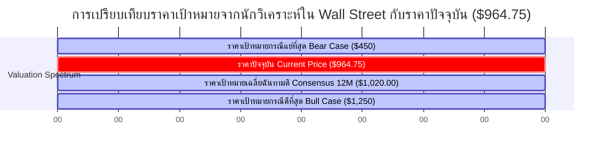

# 💎 บทวิเคราะห์วิจัยเชิงปริมาณของตราสารทุน: Micron Technology, Inc. (NASDAQ: MU)
**เรียน:** Genie (ผู้วางแผนและจัดระเบียบระบบ - Orchestration Mastermind)  
**จาก:** Valerie V2 (ผู้วิเคราะห์เชิงปริมาณ - The Quantitative Oracle)  
**วันที่:** 31 พฤษภาคม 2026  
**เรื่อง:** การตรวจสอบการประเมินราคาจริงของตราสารทุนและการวิเคราะห์คิดลดกระแสเงินสดแบบย้อนกลับ (Reverse DCF) ของ MU ณ ระดับมูลค่าหลักทรัพย์ตามราคาตลาด 1.10 ล้านล้านดอลลาร์สหรัฐ  

---

## ภาพรวมสมมติฐานหลักและคำแนะนำการลงทุน (Thesis Overview & Rating)
*   **คำแนะนำการลงทุน (Thesis Rating):** 🔴 **หลีกเลี่ยง / เฝ้าระวังอย่างใกล้ชิด (Avoid / Wait & Watch)** (ราคาหุ้นสะท้อนความคาดหวังเชิงบวกอย่างเต็มที่แล้ว - Priced to Absolute Perfection)
*   **ราคาหุ้นปัจจุบัน (Current Stock Price):** ประมาณ $964.75 (ราคาปิด ณ วันที่ 31 พฤษภาคม 2026 อยู่ที่ $971.00)
*   **มูลค่าหลักทรัพย์ตามราคาตลาด (Market Capitalization):** ประมาณ 1.10 ล้านล้านดอลลาร์สหรัฐ ($1.10 Trillion)
*   **อัตราส่วนราคาต่อกำไรสุทธิปัจจุบัน (Current P/E Ratio):** ประมาณ 45.8 เท่า (45.8x)
*   **ต้นทุนทางการเงินเฉลี่ยถ่วงน้ำหนัก (WACC) และอัตราการเติบโตในระยะสุดท้าย (Terminal Growth Rate):** WACC เท่ากับ 10.5% / อัตราการเติบโตในระยะสุดท้าย ($g$) เท่ากับ 3.0%
*   **การประเมินโดยผู้สอบทานเชิงปริมาณ (Auditor Assessment):** ณ ระดับมูลค่าตลาดที่ 1.10 ล้านล้านดอลลาร์สหรัฐ ตลาดได้ทำการปรับมูลค่าใหม่เชิงโครงสร้าง (Structural Repricing) ของ Micron อย่างสมบูรณ์แบบ โดยพหุคูณมูลค่าหุ้นพรีเมียมตามการเติบโตเชิงโครงสร้างระยะยาว (Premium Secular Growth Multiple) ได้เข้ามาแทนที่ส่วนลดมูลค่าหุ้นตามวัฏจักรของอุตสาหกรรมหน่วยความจำแบบเดิม (Cyclical Memory Discount) อย่างไรก็ดี จากการตรวจสอบด้วยหลักคณิตศาสตร์อย่างเข้มงวดพบว่า ราคาปัจจุบันของหุ้นกำหนดให้บริษัทต้องมีอัตราการเติบโตของกระแสเงินสดอิสระ (FCF) ต่อปีโดยนัยในช่วง 10 ปีข้างหน้าสูงถึง **31.82% ถึง 39.28%** ซึ่งส่งผลให้มีส่วนเผื่อเพื่อความปลอดภัยแบบไม่สมมาตร (Asymmetric Margin of Safety) ที่เอนเอียงไปทางด้านลบอย่างรุนแรง (Skewed to the Downside) ทำให้อัตราผลตอบแทนต่อความเสี่ยงขั้นต่ำที่กำหนดไว้ในสัดส่วน 3 ต่อ 1 (3-to-1 Upside-to-Downside Payoff Ratio) ไม่สามารถสัมฤทธิ์ผลได้อีกต่อไป ณ จุดเข้าซื้อนี้

---

## 1. แบบจำลองธุรกิจและการวิเคราะห์ปราการทางเศรษฐกิจ (Business Model & Moat Analysis)
ณ ระดับมูลค่าหลักทรัพย์ตามราคาตลาดที่ **1.10 ล้านล้านดอลลาร์สหรัฐ** Micron ไม่ได้ถูกประเมินมูลค่าในฐานะผู้ผลิตหน่วยความจำประเภทสินค้าโภคภัณฑ์ (Commodity Memory Producer) อีกต่อไป ทว่าได้รับการยอมรับในฐานะเสาหลักที่ขาดไม่ได้ของโครงสร้างพื้นฐานระบบปัญญาประดิษฐ์ (AI) ระดับโลก ปราการทางเศรษฐกิจ (Economic Moat) ของบริษัทตั้งอยู่บนสามเสาหลักเชิงโครงสร้างดังนี้:

### ก. โครงสร้างตลาดผู้ขายน้อยรายที่มีการกระจุกตัวสูงและอำนาจในการกำหนดราคา (Consolidated Oligopoly Structure & Pricing Power)
อุตสาหกรรม DRAM ระดับโลกได้รวมตัวกันจนกลายเป็นตลาดผู้ขายน้อยรายที่มีความเข้มงวดเชิงวินัยการผลิตสูงเพียงสามรายใหญ่ (Triopoly) ได้แก่ **Samsung (ส่วนแบ่งตลาด 40-42%)**, **SK hynix (ส่วนแบ่งตลาด 33-35%)** และ **Micron (ส่วนแบ่งตลาด 20-22%)** โครงสร้างตลาดเช่นนี้ทำหน้าที่เป็นอุปสรรคสำคัญในการเข้าสู่ตลาดสำหรับผู้เล่นรายใหม่ (Barrier to Entry) ณ มูลค่ากิจการ 1.10 ล้านล้านดอลลาร์สหรัฐ อำนาจในการกำหนดราคา (Pricing Power) ของ Micron ได้รับการสนับสนุนจากวินัยในการควบคุมอุปทานร่วมกันของอุตสาหกรรม นอกจากนี้ กำลังการผลิต DRAM แบบดั้งเดิม (Legacy DRAM) กำลังถูกปรับเปลี่ยนระบบและทดแทนด้วยสายการผลิตหน่วยความจำแบนด์วิดท์สูง หรือ HBM (High-Bandwidth Memory) อย่างจริงจัง ซึ่งกระบวนการผลิต HBM นี้จำเป็นต้องใช้แผ่นเวเฟอร์ (Wafer Capacity) มากกว่าการผลิต DDR5 DRAM มาตรฐานถึงประมาณ **3 เท่า** การหดตัวเชิงโครงสร้างของอุปทาน DRAM มาตรฐานนี้ช่วยรับประกันว่า แม้แต่ตลาดผู้บริโภคทั่วไป (PC/Mobile) ก็ยังคงดำเนินงานภายใต้สภาวะอุปสงค์และอุปทานที่ตึงตัว ซึ่งส่งผลให้ Micron สามารถรักษาระดับราคาขายเฉลี่ย (Average Selling Prices: ASPs) ให้อยู่ในระดับสูงได้

### ข. ความร่วมมือในการออกแบบโมดูล HBM3E เฉพาะด้านและความเป็นผู้นำทางเทคโนโลยี (Custom HBM3E Co-Packaging & Technological Lead)
โมดูล **HBM3E (High-Bandwidth Memory 3rd Generation Extended)** ขนาด 24GB และ 36GB ของ Micron มอบความได้เปรียบด้านประสิทธิภาพการใช้พลังงาน (Power-Efficiency Advantage) เหนือคู่แข่งรายสำคัญถึง **30%** ซึ่งในศูนย์ข้อมูลยุคปัจจุบัน พลังงานไฟฟ้านับเป็นข้อจำกัดที่สำคัญที่สุด การลดการแพร่กระจายความร้อนและการสูญเสียพลังงานไฟฟ้าลง 30% แปลงเป็นมูลค่าการประหยัดต้นทุนการเป็นเจ้าของทั้งหมด (Total Cost of Ownership: TCO) สำหรับผู้ให้บริการระบบคลาวด์ขนาดใหญ่พิเศษ (Hyperscalers) นอกจากนี้ HBM3E แตกต่างจาก DRAM ทั่วไปตรงที่มันจะถูกรวมแพ็คเกจโดยตรง (Co-packaged) เข้ากับชิ้นส่วนวงจรรวมเชื่อมต่อ (GPU Interposer) ควบคู่กับชิปประมวลผลตรรกะ (Logic Dies) (อาทิ ชิปสถาปัตยกรรม Hopper และ Blackwell ของ Nvidia) โดยใช้เทคโนโลยีการซ้อนชิปขั้นสูงผ่านช่องนำสัญญาณซิลิคอน (Through-Silicon Via: TSV) ส่งผลให้เกิดโครงสร้างสถาปัตยกรรมประสิทธิภาพสูงที่ออกแบบร่วมกันเฉพาะด้าน และแปรสภาพเป็นสายผลิตภัณฑ์ที่มีความเหนียวแน่นสูงกับลูกค้า (High Sticky Product Line) แทนที่จะเป็นสินค้าโภคภัณฑ์ที่พร้อมถอดเปลี่ยนใช้งานทั่วไป (Plug-and-Play Commodity)

### ค. ปราการจากการทดสอบและรับรองคุณภาพโดย Nvidia และต้นทุนการเปลี่ยนคู่ค้าที่สูง (Rigorous Nvidia Qualification Moat & High Switching Costs)
ความสัมพันธ์ระหว่าง Micron และ NVIDIA ได้พัฒนาไปสู่ระบบนิเวศทางเทคโนโลยีที่มีการล็อกอินร่วมกันอย่างเหนียวแน่น:
*   **วัฏจักรการทดสอบและรับรองมาตรฐานผลิตภัณฑ์ (The Qualification Cycle - 6 ถึง 12 เดือน):** ผู้ให้บริการระบบคลาวด์ขนาดใหญ่พิเศษ (Hyperscalers) และผู้ออกแบบ GPU จะต้องทดสอบโมดูลหน่วยความจำอย่างละเอียดเพื่อตรวจสอบความเข้ากันได้ด้านความร้อน (Thermal), จังหวะเวลาการทำงาน (Timing) และการส่งสัญญาณ (Signaling) เมื่อโมดูลของ Micron ได้รับการรับรองและบูรณาการเข้ากับแพลตฟอร์ม GPU (เช่น Blackwell Ultra หรือ Rubin) แล้ว ต้นทุนในการเปลี่ยนคู่ค้าสำหรับลูกค้า (Switching Costs) จะสูงจนไม่สามารถเปลี่ยนได้ในทางปฏิบัติ
*   **การล็อกอินผ่านชัยชนะในการออกแบบ (Design-Win Lock-In):** การเปลี่ยนผู้ผลิตหน่วยความจำในระหว่างวัฏจักรการผลิตมีความเสี่ยงที่จะก่อให้เกิดปัญหาความไม่เข้ากันด้านความร้อน ความล่าช้าของการส่งสัญญาณ และอัตราผลผลิตผลิตภัณฑ์ที่ใช้งานได้ลดลงอย่างรุนแรงในการบรรจุภัณฑ์ขั้นสูง (Advanced Packaging Yield Drops) สิ่งนี้ช่วยล็อกปริมาณอุปทานในระยะเวลาหลายปี และปรับเปลี่ยนแบบจำลองธุรกิจของ Micron ให้เข้าใกล้ลักษณะสัญญาระยะยาวที่มีความสามารถในการคาดการณ์รายได้สูง คล้ายคลึงกับแบบจำลองการจำหน่ายซอฟต์แวร์ (Design-Win Model)

---

## 2. ผลประกอบการล่าสุดและการตรวจสอบความแข็งแกร่งทางการเงิน (Latest Earnings & Financial Health Audit)
การตรวจสอบผลประกอบการทางการเงินในไตรมาสที่ 2 ของปีงบประมาณ 2026 (Q2 FY2026) อย่างเข้มงวด แสดงให้เห็นถึงแรงขับเคลื่อนการดำเนินงานที่แข็งแกร่งเป็นประวัติการณ์ ทว่าในขณะเดียวกันก็สะท้อนถึงลักษณะการดำเนินงานที่ใกล้แตะจุดสูงสุดของวัฏจักร (Peak-Cycle Nature) เช่นกัน:

### ข้อมูลสำคัญทางการเงินประจำไตรมาสที่ 2 ปีงบประมาณ 2026 (Q2 FY2026 Financial Highlights)
*   **รายได้ประจำไตรมาส (Quarterly Revenue):** **2.386 หมื่นล้านดอลลาร์สหรัฐ** (เติบโตอย่างก้าวกระโดดถึง **196% เมื่อเทียบกับปีก่อน (YoY)** จากจุดต่ำสุดของวัฏจักรในปี 2023-2024 คิดเป็นอัตราการดำเนินงานต่อปีโดยประมาณอยู่ที่ประมาณ 9.54 หมื่นล้านดอลลาร์สหรัฐ) ซึ่งสูงกว่าตัวเลขคาดการณ์เฉลี่ยของ Wall Street อย่างมีนัยสำคัญ
*   **อัตรากำไรขั้นต้นที่มิใช่มาตรฐาน GAAP (Non-GAAP Gross Margin):** **74.9%** (ระดับสูงสุดเป็นประวัติการณ์อันเนื่องมาจากสภาวะอุปทานของอุตสาหกรรมที่ตึงตัว การกำหนดราคาพรีเมียมระดับสูงของโมดูล HBM3E และการรักษาระดับอัตราผลผลิตผลิตภัณฑ์ (Yield Rates) ที่ดีเยี่ยมในเทคโนโลยีโหนด 1-beta DRAM และ 232-layer NAND)
*   **กำไรต่อหุ้นปรับลดที่มิใช่มาตรฐาน GAAP (Non-GAAP Diluted EPS):** **$5.21 ต่อหุ้น** (สูงกว่าความคาดหมายของตลาด ซึ่งสะท้อนถึงผลบวกของการประหยัดเนื่องจากขนาดและคานงัดการดำเนินงานในระดับสูง - Operating Leverage)

### การตรวจสอบกระแสเงินสดและงบแสดงฐานะการเงิน (Cash Flow & Balance Sheet Audit)
*   **เงินสดและสภาพคล่อง (Cash and Liquidity):** Micron มีเงินสด รายการเทียบเท่าเงินสด และหลักทรัพย์ในความต้องการของตลาดระยะสั้นรวมกันมูลค่า **1.28 หมื่นล้านดอลลาร์สหรัฐ**
*   **หนี้สินรวม (Total Debt):** ยอดหนี้สินรวมอยู่ที่ **1.22 หมื่นล้านดอลลาร์สหรัฐ** ส่งผลให้มีสถานะหนี้สินสุทธิเป็นบวกเล็กน้อย (มีเงินสดสุทธิ - Net Cash Position อยู่ที่ **600 ล้านดอลลาร์สหรัฐ**)
*   **ภาระผูกพันรายจ่ายฝ่ายทุน (CapEx Commitment):** รายจ่ายฝ่ายทุนในไตรมาสที่ 2 ของปีงบประมาณ 2026 อยู่ที่ **8.2 พันล้านดอลลาร์สหรัฐ** สะท้อนถึงการจัดสรรเงินทุน (Capital Allocation) ที่เชิงรุกอย่างมากในการขยายห้องสะอาดปลอดฝุ่น (Cleanroom) ในรัฐไอดาโฮและนิวยอร์ก ควบคู่กับการลงทุนในสายการผลิตและบรรจุภัณฑ์ขั้นสูงสำหรับ HBM ในไต้หวัน
*   **ความเห็นด้านความแข็งแกร่งทางการเงิน (Financial Health Verdict):** **🟢 แข็งแกร่งเป็นเลิศ (Exceptionally Strong)** งบแสดงฐานะการเงินที่มีสภาพคล่องสูงและสถานะเงินสดสุทธิที่แข็งแกร่งช่วยรองรับผลกระทบจากความผันผวนของปัจจัยมหภาค (Macro Shocks) ได้อย่างดี อย่างไรก็ดี อัตราการใช้รายจ่ายฝ่ายทุนในระดับสูง (ซึ่งมีแนวโน้มว่าจะสูงเกินกว่า **3.2 หมื่นล้านดอลลาร์สหรัฐ** ต่อปี) หมายความว่า การแปลงรายได้เป็นกระแสเงินสดอิสระ (Free Cash Flow Conversion) จะมีความอ่อนไหวสูงมากต่อการลดลงเพียงเล็กน้อยของราคาขายเฉลี่ย (ASPs)

---

## 3. การประเมินมูลค่าและการคิดลดกระแสเงินสดแบบย้อนกลับภาคบังคับ (Valuation & The Mandatory Reverse DCF)
เพื่อแปลงโครงสร้างความคาดหวังของตลาดจากระดับราคาหุ้นปัจจุบันที่ **$964.75 (คิดเป็นมูลค่าหลักทรัพย์ตามราคาตลาด 1.10 ล้านล้านดอลลาร์สหรัฐ)** เราจึงได้จัดทำแบบจำลองกระแสเงินสดคิดลดแบบย้อนกลับ (Reverse DCF) ตามเกณฑ์มาตรฐานที่เข้มงวด

### สมมติฐานและสูตรคำนวณของแบบจำลอง (Model Assumptions & Formula)
เราใช้แบบจำลองคิดลดกระแสเงินสด (DCF) แบบกำหนดช่วงเวลา 10 ปี แล้วเปลี่ยนผ่านไปสู่อัตราการเติบโตระยะยาวในช่วงสุดท้ายที่มีเสถียรภาพหลังจากนั้น:
$$PV = FCF_0 \times \left( \sum_{t=1}^{10} \left( \frac{1 + g_{implied}}{1 + WACC} \right)^t + \frac{1 + g_{terminal}}{WACC - g_{terminal}} \times \left( \frac{1 + g_{implied}}{1 + WACC} \right)^{10} \right)$$

*   **มูลค่าองค์กร / มูลค่าส่วนของผู้ถือหุ้นเป้าหมาย ($PV$):** 1.10 ล้านล้านดอลลาร์สหรัฐ ($1,100 Billion)
*   **ต้นทุนทางการเงินเฉลี่ยถ่วงน้ำหนัก ($WACC$):** 10.5% (สะท้อนถึงต้นทุนส่วนของผู้ถือหุ้น, สัดส่วนหนี้สิน และโครงสร้างความเสี่ยงตามมาตรฐานของอุตสาหกรรมเซมิคอนดักเตอร์)
*   **อัตราการเติบโตในระยะสุดท้าย ($g_{terminal}$):** 3.0%
*   **ฐานกระแสเงินสดอิสระปรับปรุงปกติเริ่มต้น ($FCF_0$):** เราสร้างแบบจำลองสถานการณ์กระแสเงินสดอิสระเริ่มต้นที่สมเหตุสมผล 3 สถานการณ์ ได้แก่ **6.0 พันล้านดอลลาร์สหรัฐ** (ฐานอนุรักษนิยมปรับปรุงปกติ), **8.0 พันล้านดอลลาร์สหรัฐ** (ฐานกึ่งวัฏจักรที่สมเหตุสมผล) และ **1.0 หมื่นล้านดอลลาร์สหรัฐ** (ฐานสภาวะบวกสูงสุดในระยะสั้น)

---

### ตารางวิเคราะห์ความไวของอัตราการเติบโตของกระแสเงินสดอิสระ (FCF) ต่อปีโดยนัยในระยะ 10 ปี (Implied 10-Year Annual FCF Growth Rate Sensitivity Matrix)
จากการคำนวณหาค่า $g_{implied}$ ภายใต้อัตราคิดลดและฐานกระแสเงินสดเริ่มต้นในระดับที่แตกต่างกัน จะได้อัตราการเติบโตที่ซ่อนอยู่ในราคาหุ้นปัจจุบันดังตารางต่อไปนี้:

| ฐานกระแสเงินสดอิสระปรับปรุงปกติ ($ FCF_0 $ - พันล้านดอลลาร์สหรัฐ) | WACC = 9.5% | WACC = 10.5% (กรณีฐาน) | WACC = 11.5% |
| :--- | :---: | :---: | :---: |
| **$6.0B** (ฐานอนุรักษนิยมปรับปรุงปกติ) | 36.41% | **39.28%** | 41.98% |
| **$8.0B** (ฐานกึ่งวัฏจักรที่สมเหตุสมผล) | 32.28% | **35.05%** | 37.64% |
| **$10.0B** (ฐานสภาวะบวกสูงสุดในระยะสั้น) | 29.13% | **31.82%** | 34.32% |

> [!IMPORTANT]
> **ข้อค้นพบหลักจากการคิดลดกระแสเงินสดแบบย้อนกลับ (Core Reverse DCF Finding):**  
> แม้ภายใต้สมมติฐานกรณีบวกสูงสุดที่ใช้ฐานกระแสเงินสดอิสระเริ่มต้น (FCF) ในระดับ **1.0 หมื่นล้านดอลลาร์สหรัฐ** และอัตราต้นทุนทางการเงินเฉลี่ยถ่วงน้ำหนักปกติที่ **10.5% WACC** ราคาหุ้นในปัจจุบันที่ประมาณ ~$964.75 บ่งชี้ว่า Micron จะต้องสร้างการเติบโตแบบทบต้นของกระแสเงินสดอิสระต่อปีในอัตราสูงถึง **31.82% ต่อเนื่องกันเป็นเวลา 10 ปี** และหากพิจารณาบนฐานกระแสเงินสดปรับปรุงปกติที่เป็นจริงที่ **6.0 พันล้านดอลลาร์สหรัฐ** อัตราการเติบโตต่อปีโดยนัยจะขยับขึ้นสูงถึงระดับที่น่าเหลือเชื่อถึง **39.28%**

---

### การประเมินทิศทางมูลค่าหุ้น: สูงกว่ามูลค่าพื้นฐาน หรือ ต่ำกว่ามูลค่าพื้นฐาน? (Trajectory Assessment)
ราคาหุ้นปัจจุบันที่ $964.75 ถือว่าอยู่ในระดับที่ **สูงกว่ามูลค่าพื้นฐานอย่างมาก (Highly Overvalued)** โดยมีคำอธิบายประกอบอัตราการเติบโตโดยนัยนี้ดังต่อไปนี้:
1.  **ไม่มีแบบอย่างในประวัติศาสตร์ (Historically Unprecedented):** การเติบโตทบต้นของกระแสเงินสดในอัตราที่สูงกว่า 30% ต่อปีเป็นเวลาหนึ่งทศวรรษนั้น แทบจะเป็นไปไม่ได้เลยในกลุ่มอุตสาหกรรมการผลิตที่เน้นสินทรัพย์ถาวรสูงและมีลักษณะเป็นวัฏจักร (Asset-heavy, Cyclical manufacturing) แม้แต่บริษัทซอฟต์แวร์ผูกขาดที่มีอัตรากำไรสูงเป็นพิเศษ (เช่น Microsoft หรือ Adobe) ก็ยังเผชิญกับความยากลำบากอย่างยิ่งในการรักษาอัตราการเติบโตที่ระดับ 30% ในช่วงเวลา 10 ปี
2.  **ความไม่สอดคล้องกับการเติบโตของอุตสาหกรรม (Industry Growth Disconnect):** อัตราการเติบโตสะสมต่อปี (CAGR) ของอุตสาหกรรมเซมิคอนดักเตอร์โลกได้รับการคาดการณ์ว่าจะอยู่ที่ระดับ **8% ถึง 12%** ในอีกทศวรรษข้างหน้า ขณะที่ตลาด HBM ทั่วโลกกำลังเติบโตในอัตรา CAGR มากกว่า 50% ในช่วงเริ่มต้นของการเติบโตแบบก้าวกระโดด (ปี 2024-2028) แต่ในท้ายที่สุดก็จะชะลอตัวลงมาอยู่ในระดับต่ำกว่า 10% เมื่อกำลังการผลิตใหม่ตามทันอุปสงค์และการขยายตัวของโครงสร้างพื้นฐาน AI เริ่มเข้าสู่สภาวะอิ่มตัว
3.  **ภาระจากรายจ่ายฝ่ายทุน (CapEx Drag):** เพื่อรักษาการเติบโตในระดับดังกล่าว Micron จำต้องลงทุนหลายแสนล้านดอลลาร์สหรัฐในรายจ่ายฝ่ายทุน (CapEx) เพื่อขยายโรงงานผลิตชิป (Fab) ซึ่งภาระค่าใช้จ่ายอันหนักหน่วงนี้จะบีบให้อัตราการแปลงรายได้เป็นกระแสเงินสดอิสระ (FCF Conversion Rate) ปรับตัวลดลง ส่งผลให้อัตราการเติบโตของรายได้จริงที่จำเป็นต้องทำได้นั้น สูงกว่าอัตราการเติบโตของกระแสเงินสดอิสระ (FCF) เสียอีก

---

## 4. แนวโน้มการดำเนินงานในอนาคตและปัจจัยเร่งเชิงบวก (Future Guidance & Catalysts)
แม้ระดับราคาประเมินจะสูงจนเกินไป แต่แรงผลักดันการดำเนินงานในระยะสั้นยังคงได้รับแรงสนับสนุนจากปัจจัยเร่งเชิงบวกที่สำคัญในช่วง 12 ถึง 24 เดือนข้างหน้า:

*   **การเปลี่ยนผ่านสู่เทคโนโลยีการเชื่อมต่อชิปขั้นสูง HBM4 Hybrid Bonding (2027):** การเปลี่ยนผ่านสู่ HBM4 จะเป็นจุดเปลี่ยนเชิงโครงสร้างสถาปัตยกรรมที่สำคัญ โดยจะหันมาใช้ชิ้นส่วนวงจรรวมตรรกะฐานเฉพาะด้าน (Customized Logic Base Die) ที่ผลิตจากผู้รับจ้างผลิตขั้นสูง (เช่น TSMC 3nm/5nm) และใช้เทคโนโลยีบรรจุภัณฑ์ขั้นสูงแบบไฮบริดบอนดิ้ง (Hybrid Bonding Advanced Packaging) ความสามารถของ Micron ในการดำเนินการเปลี่ยนผ่านนี้ได้อย่างไร้รอยต่อจะช่วยให้บริษัทสามารถชิงส่วนแบ่งการตลาดมาจาก SK hynix ได้
*   **การเติบโตของ Edge AI (การปรับเปลี่ยนอุปกรณ์ฝั่งผู้ใช้งาน):** คอมพิวเตอร์ส่วนบุคคล (AI PCs) และสมาร์ทโฟนยุคใหม่ที่ติดตั้งระบบ AI จำเป็นต้องใช้ **ปริมาณ DRAM ต่อเครื่องเพิ่มขึ้น 50% ถึง 100%** (ตัวอย่างเช่น เกณฑ์มาตรฐานของคอมพิวเตอร์ทั่วไปจะขยับจาก 8GB/16GB เป็น 24GB/32GB เพื่อรองรับการทำงานของโมเดลภาษาขนาดใหญ่ หรือ LLMs ภายในอุปกรณ์) ปริมาณความต้องการที่เพิ่มขึ้นอย่างมหาศาลนี้จะช่วยดูดซับกำลังการผลิต DRAM แบบดั้งเดิม และช่วยบรรเทาความเสี่ยงของการเข้าสู่ช่วงขาลงของวัฏจักรหน่วยความจำทั่วไป
*   **ความต้องการไดรฟ์บันทึกข้อมูลระดับองค์กรความจุสูงเป็นพิเศษ (Ultra-High-Capacity Enterprise SSDs):** ความต้องการใช้งาน Enterprise SSD กำลังขยายตัวอย่างรวดเร็ว เนื่องจากการฝึกฝนและการประมวลผลโมเดล AI (AI Training and Inference) จำเป็นต้องมีแหล่งเก็บข้อมูลความเร็วสูงจำนวนมหาศาล ซึ่งช่วยเพิ่มอัตรากำไรของหน่วยความจำ 3D NAND แบบหลายชั้น (232 ชั้น และ 276 ชั้น) ของ Micron ได้อย่างต่อเนื่อง

---

## 5. รายงานสัญญาณเตือนภัยเชิงโครงสร้าง (Red Flag Report)
ในฐานะผู้ตรวจสอบเชิงปริมาณ เรามีความจำเป็นต้องระบุปัจจัยความเสี่ยงที่สำคัญซึ่งอาจทำลายสมมติฐานการลงทุนนี้อย่างมีนัยสำคัญ:

### ก. กับดักการลงทุนในรายจ่ายฝ่ายทุนที่มากเกินไปตามวัฏจักร (The Cyclical Over-CapEx Trap)
ความเสี่ยงหลักของอุตสาหกรรมหน่วยความจำคือการขยายกำลังการผลิตฝั่งอุปทานที่มากเกินไป ปัจจุบัน Samsung, SK hynix และ Micron กำลังตกอยู่ในสภาวะการแข่งขันด้านรายจ่ายฝ่ายทุนอย่างดุเดือด (CapEx arms race)
*   **ความเสี่ยง (The Risk):** จากหลักฐานทางประวัติศาสตร์ วัฏจักรขาขึ้นของอุตสาหกรรมหน่วยความจำทุกครั้งมักจะสิ้นสุดลงด้วยการพังทลายของราคาอย่างรุนแรงอันเนื่องมาจากการสร้างโรงงานผลิตที่ล้นตลาด หาก Samsung ตัดสินใจเพิ่มอุปทาน HBM และ DDR5 เข้าสู่ตลาดอย่างรุนแรงในช่วงปลายปี 2026 หรือ 2027 เพื่อทวงคืนส่วนแบ่งตลาด ราคาขายเฉลี่ย (ASPs) จะปรับตัวลดลงอย่างรวดเร็ว ซึ่งจะฉุดให้อัตรากำไรขั้นต้นที่ 74.9% ของ Micron ลดลงสู่ค่าเฉลี่ยกึ่งวัฏจักรแบบดั้งเดิมที่ระดับ 35-40%

### ข. ความเสี่ยงด้านการดำเนินงานและอัตราผลผลิตผลิตภัณฑ์ของบรรจุภัณฑ์ขั้นสูง (Execution & Advanced Packaging Yield Risk)
*   **ความซับซ้อนของ HBM4:** การซ้อนชิป DRAM จำนวน 12 ถึง 16 ชั้นเชื่อมต่อด้วยเทคโนโลยีช่องนำสัญญาณซิลิคอนขนาดเล็ก (TSV) และการใช้เทคโนโลยีไฮบริดบอนดิ้งนั้นมีความซับซ้อนอย่างสูง หากมีชิปเพียงชิ้นเดียวในตระกูลที่ซ้อนกัน 12 ชิ้นเกิดชำรุด จะส่งผลให้โมดูลนั้นทั้งหมดไม่สามารถใช้งานได้ทันที
*   **ความเสี่ยง (The Risk):** หาก Micron เผชิญกับปัญหาคอขวดในกระบวนการบรรจุภัณฑ์ชิป หรือได้อัตราผลผลิตที่ต่ำ (Poor Yields) ระหว่างการปรับเปลี่ยนระบบไปสู่ HBM4 บริษัทจะต้องเผชิญกับการปรับลดมูลค่าสินค้าคงเหลือ (Write-downs) ค่าปรับจากการผิดสัญญา และการสูญเสียลูกค้ารายใหญ่ที่มีอัตรากำไรสูงให้แก่ SK hynix และ Samsung

### ค. การกระจุกตัวของลูกค้ารายใหญ่อย่างสุดโต่ง (Extreme Customer Concentration)
*   **ความเสี่ยง (The Risk):** ยอดขาย HBM ของ Micron มีการกระจุกตัวในระดับสูง โดยอุปสงค์เกือบทั้งหมดมาจาก NVIDIA และผู้ให้บริการระบบคลาวด์ขนาดใหญ่พิเศษในสหรัฐอเมริกาเพียงไม่กี่ราย (อาทิ Microsoft, AWS, Meta, Google) การชะลอตัวใดๆ ของรายจ่ายฝ่ายทุน (CapEx) ของผู้ให้บริการเหล่านี้ หรือแม้แต่วัฏจักรการชะลอซื้อเพื่อปรับสมดุลอุปกรณ์ (Digestion Cycle) ของยอดสั่งซื้อ GPU จะส่งผลให้เกิดการยกเลิกคำสั่งซื้อแบบทันทีและรุนแรงต่อ Micron

---

## 6. มุมมองและเป้าหมายของนักวิเคราะห์ (Analyst Consensus)
ความเห็นส่วนใหญ่ใน Wall Street ยังคงอยู่ในเชิงบวกอย่างมาก ทว่าราคาเป้าหมายประเมินสะท้อนให้เห็นว่ามีส่วนต่างขาขึ้น (Upside) ที่จำกัดมากเมื่อเทียบกับระดับราคาจริงในปัจจุบัน:

*   **มุมมองโดยรวมของ Wall Street (Wall Street Sentiment):** แนะนำซื้อ 88% / แนะนำถือ 10% / แนะนำขาย 2%
*   **ราคาเป้าหมายเฉลี่ยฉันทามติในระยะ 12 เดือน (Consensus 12-Month Price Target):** **$1,020.00** (คิดเป็นส่วนต่างขาขึ้นโดยนัยเพียงเล็กน้อยที่ **+5.7%** จากราคาปัจจุบัน)
*   **ขอบเขตราคาเป้าหมายของนักวิเคราะห์ (Analyst Target Range):** ตั้งแต่ระดับต่ำสุดที่ **$450.00** (สะท้อนถึงการกลับตัวเข้าสู่วัฏจักรขาลงแบบดั้งเดิม) ไปจนถึงระดับสูงสุดที่ **$1,250.00** (ตั้งอยู่บนสมมติฐานสภาวะอุปทานขาดแคลนจากการขับเคลื่อนของ AI ต่อเนื่องไปจนถึงปี 2028)

---

## 7. คำตัดสินเชิงปริมาณและการตรวจสอบความสมมาตรของผลตอบแทนโดย Valerie (Valerie's Quantitative Verdict & Asymmetric Payoff Check)

### การตรวจสอบผลตอบแทนแบบไม่สมมาตรในสัดส่วน 3 ต่อ 1 (The 3-to-1 Asymmetric Upside Check)
เพื่อสนับสนุนสถานะการลงทุนที่มีความเชื่อมั่นสูง (High-conviction position) กรอบการทำงานเพื่อลดความเสี่ยงของเรากำหนดให้ต้องมี **อัตราผลตอบแทนต่อความเสี่ยงระหว่างขาขึ้นและขาลงอย่างน้อย 3 ต่อ 1 (3-to-1 Upside-to-Downside Ratio)** เราจึงได้จัดทำแบบจำลองแนวโน้มการประเมินมูลค่าของ Micron ในช่วงเวลาการลงทุน 3 ปีข้างหน้า ณ จุดเข้าซื้อใหม่ที่ระดับ **$964.75**:

*   **ราคาเป้าหมาย in กรณีที่ดีที่สุด - Bull Case Price Target (มูลค่าตลาดประมาณ 1.71 ล้านล้านดอลลาร์สหรัฐ): $1,500.00 ต่อหุ้น**  
    *   *สมมติฐาน:* Micron สามารถชิงส่วนแบ่งตลาด HBM4 ทั่วโลกได้ 30%, อัตราผลผลิตผลิตภัณฑ์ (Yield) คงตัวสูงกว่า 90% และกระแสเงินสดอิสระ (FCF) พุ่งสูงเป็นประวัติการณ์ที่ระดับ **5.0 หมื่นล้านดอลลาร์สหรัฐ** จากอำนาจการกำหนดราคาที่ต่อเนื่องยาวนาน พหุคูณมูลค่าหุ้นยังคงทรงตัวในระดับสูงที่ 30 เท่าของกระแสเงินสดอิสระ (30x P/FCF)
    *   *ผลลัพธ์:* **+$535.25 ต่อหุ้น (ส่วนต่างขาขึ้น +55.5%)**
*   **ราคาเป้าหมายในกรณีฐาน - Base Case Price Target (มูลค่าตลาดประมาณ 8.55 แสนล้านดอลลาร์สหรัฐ): $750.00 ต่อหุ้น**  
    *   *สมมติฐาน:* Micron สามารถรักษาส่วนแบ่งตลาด HBM ได้ที่ประมาณ 22%, อัตรากำไรปรับตัวสู่ระดับปกติที่ 45% เมื่ออุปทานเริ่มทันกับอุปสงค์ และกระแสเงินสดอิสระ (FCF) ทรงตัวที่ฐานกึ่งวัฏจักรที่ **3.5 หมื่นล้านดอลลาร์สหรัฐ** พหุคูณมูลค่าหุ้น (P/FCF multiple) ปรับตัวลดลงสู่ระดับพหุคูณปกติของกลุ่มอุปกรณ์ฮาร์ดแวร์ที่ 22 เท่า
    *   *ผลลัพธ์:* **-$214.75 ต่อหุ้น (อัตราผลตอบแทน -22.3%)**
*   **ราคาเป้าหมายในกรณีที่แย่ที่สุด - Bear Case Price Target (มูลค่าตลาดประมาณ 4.00 แสนล้านดอลลาร์สหรัฐ): $350.00 ต่อหุ้น**  
    *   *สมมติฐาน:* สงครามราคาปะทุขึ้นอย่างรุนแรงภายในปลายปี 2026 การเปลี่ยนผ่านสู่ HBM4 ของ Micron ประสบความล่าช้าส่งผลให้เกิดการสูญเสียส่วนแบ่งการตลาด กระแสเงินสดอิสระ (FCF) ปรับตัวลดลงสู่จุดต่ำสุดของวัฏจักรที่ **1.2 หมื่นล้านดอลลาร์สหรัฐ** พหุคูณมูลค่าหุ้นปรับตัวลดลงเหลือ 15 เท่า และราคาหุ้นได้รับแรงหนุนที่แนวรับอัตราส่วนราคาต่อมูลค่าทางบัญชี (P/B ratio) ระดับอนุรักษนิยมที่ 1.8 เท่า
    *   *ผลลัพธ์:* **-$614.75 ต่อหุ้น (ส่วนต่างขาลง -63.7%)**

### การคำนวณอัตราผลตอบแทนต่อความเสี่ยงเชิงคณิตศาสตร์ (Mathematical Payoff Ratio Calculation)
$$\text{Asymmetric Ratio} = \frac{\text{Bull Case Upside}}{\text{Bear Case Downside}} = \frac{\$1,500.00 - \$964.75}{\$964.75 - \$350.00} = \frac{+\$535.25}{-\$614.75} = \mathbf{0.87x}$$

> [!CAUTION]
> **ผลการยืนยันความปลอดภัย: ล้มเหลว (FAILED)**  
> อัตราผลตอบแทนต่อความเสี่ยงที่คำนวณได้คือ **0.87 เท่า (0.87x)** ซึ่งต่ำกว่าเกณฑ์บังคับขั้นต่ำของเราที่ **3.0 เท่า** อย่างมีนัยสำคัญ ณ จุดเข้าซื้อที่ $964.75 โครงสร้างความเสี่ยงต่อผลตอบแทนได้พลิกกลับด้านอย่างสิ้นเชิง โดยความเสี่ยงขาลง (-63.7% ไปยังกรณีแย่ที่สุด) มีขนาดที่สูงกว่าโอกาสการเติบโตขาขึ้นในกรณีดีที่สุดอย่างเห็นได้ชัด (+55.5%) ส่งผลให้การถือครองสินทรัพย์นี้ ณ ระดับราคาปัจจุบันมีความเสี่ยงเชิงเก็งกำไรและมีความเปราะบางสูงยิ่ง

### บทสรุปและแผนการดำเนินงาน (Conclusion & Action Plan)
ณ ระดับมูลค่าหลักทรัพย์ตามราคาตลาดที่ 1.10 ล้านล้านดอลลาร์สหรัฐ Micron ได้สะท้อนการเปลี่ยนผ่านทางเทคโนโลยีไปในการประเมินมูลค่าอย่างเต็มที่แล้ว แม้ว่าความสามารถในการดำเนินงานของบริษัทจะยังคงมีความโดดเด่นอย่างยอดเยี่ยม ทว่าในมุมมองทางคณิตศาสตร์ อัตราผลตอบแทนขั้นต่ำที่ต้องทำได้เพื่อให้สอดคล้องกับราคานี้ถือว่าไม่มีความสมเหตุสมผลเชิงการลงทุนแล้ว

**คำตัดสินโดย Valerie:** **หลีกเลี่ยง / ขายทำกำไร (AVOID / LIQUIDATE)** เราขอแนะนำให้ทำการขายทำกำไรเชิงกลยุทธ์ หรือหลีกเลี่ยงการสะสมหุ้นเพิ่มเติมในระดับราคานี้ ความเสี่ยงจากการปรับฐานตามวัฏจักรจากการลงทุนส่วนเกินในรายจ่ายฝ่ายทุน (Over-CapEx Correction) หรือความเสี่ยงจากวัฏจักรการชะลอตัวของอุปสงค์ (Demand-digestion Cycle) นั้นอยู่ในระดับสูง และราคาหุ้นในปัจจุบันไม่มีส่วนเผื่อเพื่อความปลอดภัย (Margin of Safety) หลงเหลืออยู่เลยสำหรับผู้จัดสรรเงินทุนที่มีวินัย เราจะรอคอยการปรับฐานเชิงโครงสร้างของราคาลงสู่ระดับต่ำกว่า $500 ต่อหุ้น ซึ่งเป็นระดับที่อัตราความไม่สมมาตรของผลตอบแทนต่อความเสี่ยงในสัดส่วน 3 ต่อ 1 จะสามารถกลับมาปรากฏขึ้นได้อีกครั้ง

---

## 8. เอกสารอ้างอิงและแหล่งข้อมูล (References & Data Sources)
*   **รายงานทางการเงินของบริษัท:** รายงานสารสนเทศของบริษัท Micron Technology, Inc. ต่อสำนักงาน ก.ล.ต. สหรัฐฯ Form 10-Q (ไตรมาสที่ 2 ปีงบประมาณ 2026 ยื่น ณ มีนาคม 2026), Form 10-K (ปีงบประมาณ 2025 ยื่น ณ ตุลาคม 2025)
*   **การประชุมทางโทรศัพท์ผลประกอบการ:** บทถอดความการประชุมแถลงผลประกอบการไตรมาสที่ 2 ปีงบประมาณ 2026 ของ Micron (25 มีนาคม 2026)
*   **ข้อมูลทางเลือกและข้อมูลอุตสาหกรรม:** ดัชนีราคาตลาดจรและราคาสัญญาส่งมอบล่วงหน้าของ DRAMeXchange (พฤษภาคม 2026); การคาดการณ์เทคโนโลยีการบรรจุภัณฑ์ขั้นสูงและรายจ่ายฝ่ายทุนอุตสาหกรรมเซมิคอนดักเตอร์โดย Gartner (ไตรมาสที่ 2 ปี 2026)
*   **วันที่รวบรวมและจัดทำรายงาน:** 31 พฤษภาคม 2026

---
*รายงานนี้จัดทำและตรวจสอบโดย Valerie V2 ผู้วิเคราะห์เชิงปริมาณ (The Quantitative Oracle)*
