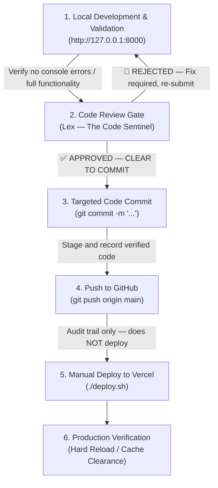

# Standard Operating Procedure: Web Development Protocol

This document defines the strict standard operating procedure (SOP) for developing, testing, and deploying changes to the Genie Investment web applications.

---

## 💡 Core Philosophy: Local-First Development
To mitigate production downtime risks, maintain clean Git history (audit trail), and ensure a fast development cycle, all website modifications must follow a **Local-First** workflow. No code changes should be deployed directly to production (Vercel) without complete local validation.

---

## 🔄 The 5-Step Development Pipeline

### Phase 1: Local Development & Validation (Local Testing)
1. **Start Local Server:** Always run the local development server before editing files.
   * **Command:** `python3 api/index.py` (run from inside `my_first_website/`)
   * **Address:** `http://127.0.0.1:8000`
   * Do NOT use `server.py` — it is legacy, SQLite-only, and does not support Supabase.
   * Reads `DATABASE_URL` from `.env` and connects to Supabase automatically; falls back to local SQLite `portfolio.db` if `.env` has no `DATABASE_URL`.
2. **Development:** Implement features or bug fixes directly within the workspace folder (`/my_first_website/`).
3. **Local Audit:** Open the local site in a web browser. Test all interactive features, inspect the developer console for warnings/errors, and ensure layout responsiveness.

### Phase 2: Code Review Gate (Lex — The Code Sentinel)
Before any code is staged for commit, invoke **Lex (The Code Sentinel)** to perform a structured technical audit.
* **Prompt to Lex:** "Review the following code changes for the Genie Investment web platform. Audit for: (1) Security vulnerabilities, (2) Logic bugs and correctness, (3) Performance issues, (4) SOP_Web_Development.md compliance. Files changed: [list modified files]. Output a structured report with severity-classified findings (🔴 CRITICAL / 🟡 WARNING / 🟢 SUGGESTION) with file:line references, and conclude with a clear ✅ APPROVED or 🚫 REJECTED verdict."
* **Gate Rule:** Code may only proceed to Phase 3 (git commit) after Lex issues a `✅ APPROVED — CLEAR TO COMMIT` verdict. A `🚫 REJECTED` verdict requires fixing all CRITICAL and WARNING items and re-submitting to Lex.

### Phase 3: In-Place Code Editing (Token-Efficiency Protocol)
1. **Avoid Full Rewrites:** Do not replace entire files (especially large files like `app.js` or `server.py`) to avoid hitting AI token limits and context bloat.
2. **Targeted Editing:** Use targeted editing tools (`replace_file_content` or `multi_replace_file_content`) to modify only the specific blocks of code requiring changes.

### Phase 4: Version Control & Code Governance (Git)
1. **Stage Changes:** Stage only verified files that are confirmed to work locally (`git add`).
2. **Commit Message:** Write clear, professional, and audit-ready commit messages explaining the change (e.g., `git commit -m "Implement HTML5 History API path routing (pushState/popstate)"`). Avoid generic messages like "fix" or "update".

### Phase 5: Production Deployment & Final Verification
1. **Push to GitHub:** Push the clean commits to the remote repository (audit trail — this does NOT trigger a deploy):
   * **Command:** `git push origin main`
2. **Manual Deploy to Vercel:** Vercel's Git Auto-Build is disabled (`vercel.json` → `"git": { "deploymentEnabled": false }`) because it fails to build the Python Lambdas correctly. Deploys must be triggered manually from the command line:
   * **Command:** `cd my_first_website && ./deploy.sh` (code-only deploy, safe — does not touch the database)
   * Use `./deploy.sh --sync` only when intentionally overwriting Supabase with local SQLite data (⚠️ deletes any data users added on production).
   * Alternative manual command: `cd ~/Desktop && npx vercel --prod` (must run from git root, not from `my_first_website/`).
3. **Hard Reload (Cache Clearance):** Clear browser caches to load the updated Javascript/CSS files:
   * **macOS:** `Cmd + Shift + R` (or hold `Shift` and click the refresh button)
   * **Windows/Linux:** `Ctrl + F5`
4. **Final Audit:** Confirm the live Vercel deployment works flawlessly and behaves exactly as validated locally.
